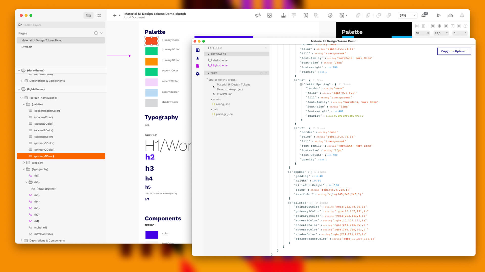

# Welcome to Stratos Tokens 2021 🏡

## What can I do with Stratos Tokens 2021?

* Use Sketch or Figma to create, update and distribute your **design tokens & theming code**
* A single place to create and edit your styles
* Reads the raw design file \(Sketch\) and generates a JSON-structure based on your design data \(design tokens\)
* You can use **any setup you want**, you have 100% control over your design token & theming structure
* Use [Stratos Tokens](https://marketplace.sketch2react.io/product/stratos-tokens-pre-release/) app to output your code
* Supports Sketch files natively, no plugins are needed
* Support for **Sketch Shared Libraries** & **Sketch Symbols** - manage several brands remotely for your clients
* Export to NPM
* Export to iOS, Android, CSS via our built-in [Style Dictionary support](https://amzn.github.io/style-dictionary/#/)\*


\*_Requires you to_[ _structure your design tokens_](https://amzn.github.io/style-dictionary/#/properties?id=examples) _in your design application as Style Dictonary needs them to be or the export will not work_


### Example of Style Dictionary naming and structure conventions



## Enhance your design systems with design tokens

**Design tokens are design decisions.** With our app you create **real code design decisions** directly inside your design application, where most of these are actually made. 

Here's [an example](https://www.notion.so/Style-Dictionary-Design-System-Inc-3cfa229455854cc29e35734b76349b85) of how you could document your design system with design tokens.

## Software requirements

* Sketch v68–72+ or latest Figma
* [Stratos Tokens](https://marketplace.sketch2react.io/product/stratos-tokens-pre-release/) App
* Our [Sketch assistant](https://www.sketch.com/extensions/assistants/stratos-tokens-assistant/) \(not required but nice to have\)
* macOS Catalina or Big Sur \| Windows 10
* NPM & [Node.js](https://nodejs.org/en/download/)
* Use your preferred external code editor

Stratos Tokens 2021.7.0 ****- Designed and developed in Stockholm with 💗 by [Team Sketch2React](https://sketch2react.io) ©2021

