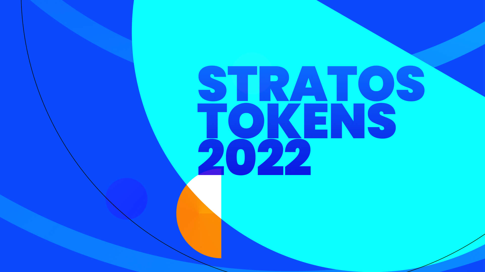

# Welcome to Stratos Tokens 🏡

## What can I do with Stratos Tokens?

<figure><figcaption></figcaption></figure>

* Use Sketch or Figma to create, update and distribute your **design tokens & theming code**
* A single place to create and edit your styles
* Reads the raw design file and generates a JSON-structure based on your design data (design tokens)
* You can use **any setup you want**, you have 100% control over your design token & theming structure
* Use [Stratos Tokens](https://marketplace.sketch2react.io/product/stratos-tokens/) app to output your code
* Supports Sketch & Figma files natively, no plugins are needed
* Support for **Sketch Shared Libraries** & **Sketch Symbols** — manage several brands remotely for your clients
* Support for Figma's Auto Layout
* Export to NPM
* Export to iOS, Android, CSS via our built-in [Style Dictionary support](https://amzn.github.io/style-dictionary/#/)\*

> Requires you to [structure your design tokens](https://amzn.github.io/style-dictionary/#/properties?id=examples) in your design application as Style Dictionary needs them to be, or the conversion will not work

### Example of Style Dictionary naming and structure conventions

Here’s a basic[ yet educational example](https://sketch.cloud/s/cbcda2f0-04f6-481f-a7b4-8d12d66faf56) of how you could set up for following Style Dictionary’s conventions.

## Enhance your design systems with design tokens

**Design tokens are design decisions.** With our app, you create **real code design decisions** directly inside your design application, where most of these are actually made.

Here's [an example](https://www.notion.so/Style-Dictionary-Design-System-Inc-3cfa229455854cc29e35734b76349b85) of how you could document your design system with design tokens.

### Software requirements

* Sketch v80+, Figma or Lunacy 8+
* [Stratos Tokens](https://marketplace.sketch2react.io/product/stratos-tokens-pre-release/) App
* Our [Sketch assistant](https://www.sketch.com/extensions/assistants/stratos-tokens-assistant/) (not required but nice to have)
* macOS Big Sur or Monterey | Windows 10 or 11
* NPM & [Node.js](https://nodejs.org/en/download/)
* Use your preferred external code editor

Stratos Tokens 2022.4.1 — Designed and developed in Stockholm with 💗 by [Team Sketch2React](https://sketch2react.io) ©2022
