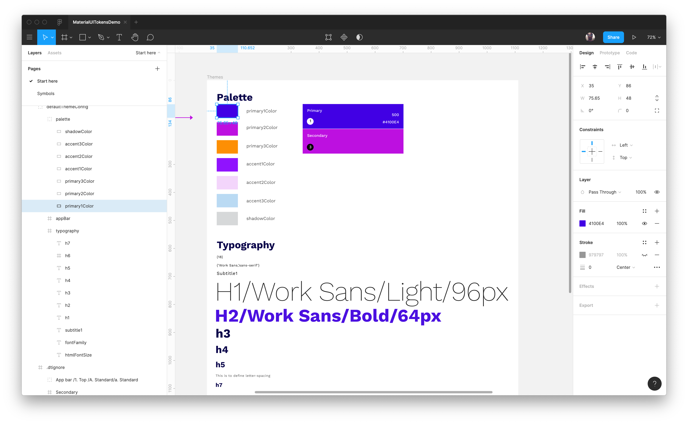
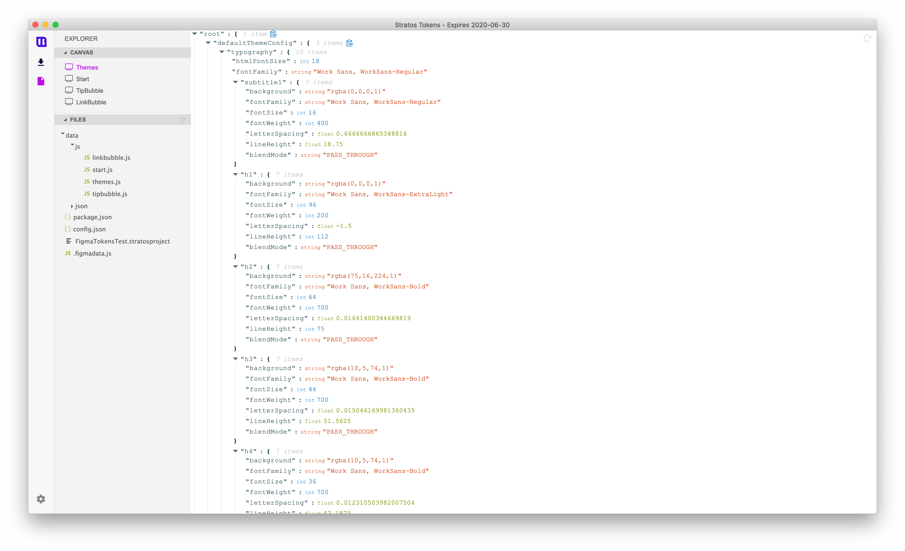

# Welcome to Stratos Tokens

## Stratos Tokens – Build your design tokens & themes directly from Sketch, Figma & InVision Studio

## What can I do with Stratos Tokens?

* Use Sketch, Figma or InVision Studio to setup and control your **design tokens & theming structure**
* A single place to create and edit your styles
* Reads the raw design file \(Sketch, Figma or InVision Studio\) and generates a JSON-structure based on your design data \(design tokens\)
* You can use **any setup you want**, you have 100% control over your design token & theming structure
* Use [Stratos Tokens app](https://gumroad.com/l/stratosalphabeta) \(Mac only\) to output your code
* Supports Sketch, Figma & InVision Studio files natively, no plugins are needed
* Export to NPM
* Export to iOS, Android, CSS via our built-in [Style Dictionary support](https://amzn.github.io/style-dictionary/#/)

## Software requirements

* Latest versions of Sketch, Figma & InVision Studio
* [Stratos Tokens App](https://gumroad.com/l/stratosalphabeta) for Mac
* OSX Mojave latest or Catalina latest
* NPM & Node.js
* Use your preferred external code editor

Stratos Tokens 1.0.2 - Designed and developed in Stockholm with 💗 by [Team Sketch2React](https://sketch2react.io) ©2020

