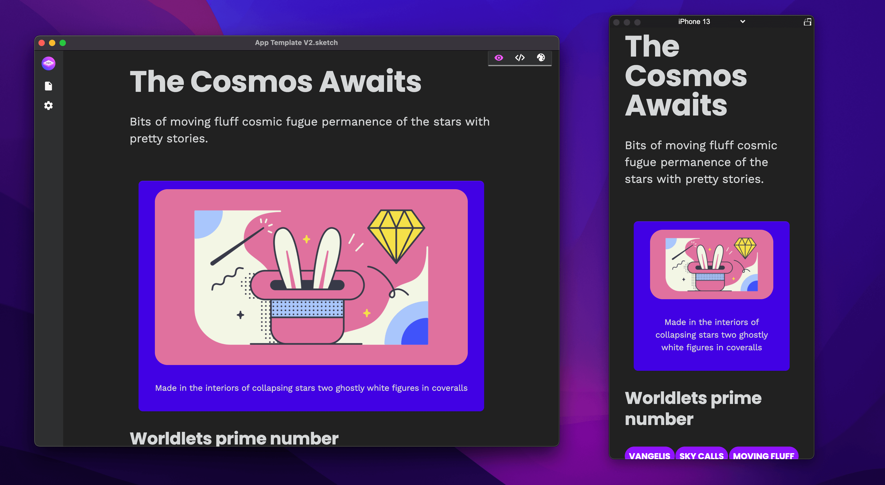

# Welcome to Marcode Docs 🏡

Build in your design app\
Ship to iOS & Android
---------------------

## What is Marcode?

Marcode is a **companion app for Sketch and Icons8 Lunacy** that reads the .sketch file in real time and outputs autogenerated code. No plugins needed, all is done using easy to learn markup on layers & groups.

> It's like having an extra layer of code, but straight inside your preferred design app 💪

* Design with markup that's easy to learn!&#x20;
* Fully responsive
* Zero plugins
* Treat the layers view in Sketch & Icons8 Lunacy as a very simple **code editor**
* Use CSS plugins
* Offline mode
* Hot reload
* Build entire static websites directly from inside of Sketch or Icons8 Lunacy 🤯
* Exports directly to [Capacitor.js](https://capacitorjs.com) projects – Build cross platform apps 💪
* Exports to HTML bundle that includes .html, css and all relevant files


Also download our [Sketch Assistant](https://www.sketch.com/extensions/assistants/@sketch2react/sketch2react-assistant/), it's 100% compatible with Marcode


## Software requirements

* [Sketch](https://sketch.com) 80+ or [Icons 8 Lunacy](https://apps.apple.com/se/app/icons8-lunacy/id1582493835?mt=12)
* Marcode 2022
* OSX Big Sur or Monterey
* [Sketch assistant](https://www.sketch.com/extensions/assistants/@sketch2react/sketch2react-assistant/) (not required but nice to have)

Marcode v2022.1.3 - Designed and developed in Stockholm with 💗 by Sketch2React AB ©2018–2022
