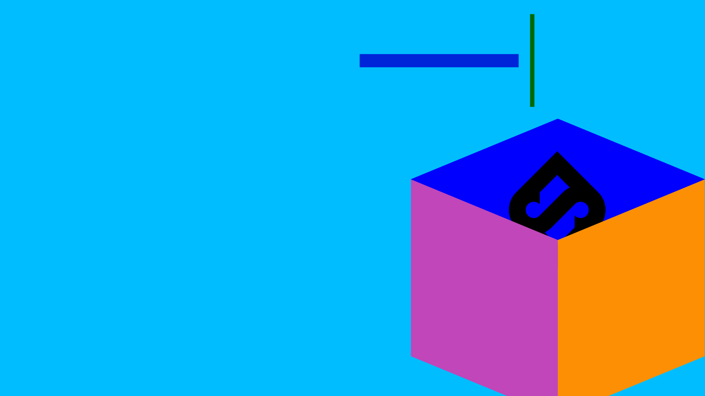

# Welcome to Stratos Components 🏡

## Stratos Components – Design to production-ready code really fast


Go from .sketchfiles \(_and soon Figma files_\) to code really fast!

### Stratos consists of two parts:

* A design markup language called **Stratos Markup**
* **Code App**


## What can I do with Stratos Components?

* Design with the **built-in tools in Sketch**
* Use **Stratos Markup** to name layers & groups, really easy to learn
* Create **custom React components** within our Stratos app
* Export **styled components** to React & Vue
* Export to **NPM** projects
* Export to React website project & HTML5 website project
* Fully responsive
* Zero plugins
* Visual way of learning more about code
* Treat the layers view in your design application as a very simple **code editor**
* Use CSS plugins
* Offline mode
* Hot reload means real-time code previews

## Software requirements

* Sketch 60+
* [Stratos Components App](https://gumroad.com/l/stratoswfh)
* OSX Mojave or Catalina
* NPM & Node.js
* Use your preferred external code editor for more advanced features

Stratos Alpha v0.5.1 - Designed and developed in Stockholm with 💗 by Team Sketch2React ©2019-2020

