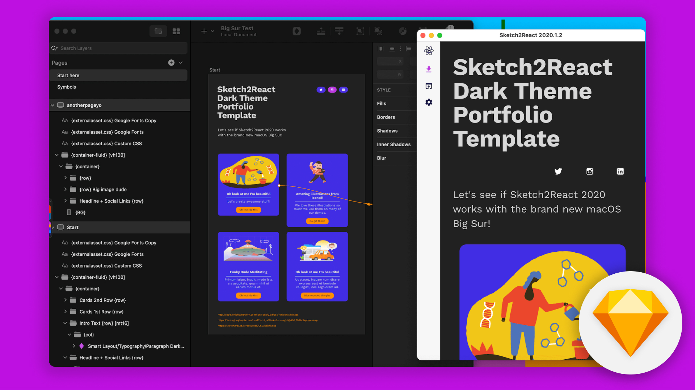

# Welcome to Sketch2React 🏡

## Go from Sketch file to Xcode, iOS, Android & Web app&#x20;

### **No coding, just markup**


Go from .sketchfiles (_via our framework_) to code really fast!

### Sketch2React is:

* **Markdown framework, **[**code app**](https://marketplace.sketch2react.io/product/sketch2react/)**, **[**Sketch assistant**](https://www.sketch.com/extensions/assistants/@sketch2react/sketch2react-assistant/)****
* **Website HTML project export**
* **Website React project export** (via create-react-app)
* Export **directly to iOS & Android **with built-in[ Capacitor.js export](https://sketch2react.gitbook.io/sketch2react-io/develop/exporting-to-code#export-to-capacitor-js)


## What is Sketch2React?

****[**Sketch2React**](https://sketch2react.io) is a companion app that lets you **build React & HTML powered prototypes (and simple websites) **directly from inside Sketch or Lunacy 💎

> That gives you high fidelity code right from scratch 💪

* Design with **markup that's easy to learn!** It's more like [**Markdown**](https://en.wikipedia.org/wiki/Markdown)****
* Fully responsive
* Zero plugins
* Treat the layers view in Sketch or Lunacy as a very simple **code editor**
* Use CSS plugins
* Offline mode
* Hot reload
* Build entire static React powered websites directly from inside of Sketch 🤯
* **N E W** 👉 Export directly to [Capacitor.js](https://capacitorjs.com) projects – Build cross platform apps, start inside Sketch 💪
* Export to HTML package that includes .html, css and all relevant files
* React code & components


Also download our brand new [Sketch Assistant](https://www.sketch.com/extensions/assistants/@sketch2react/sketch2react-assistant/), it's awesome. We promise 😺


## Software requirements

* [Sketch](https://sketch.com) 68–80+ or [Lunacy 8](https://icons8.com/lunacy)
* [Sketch2React 2021](https://marketplace.sketch2react.io/product/sketch2react/)
* OSX Catalina or Big Sur (requires v70+ of Sketch app)
* [Sketch assistant](https://www.sketch.com/extensions/assistants/@sketch2react/sketch2react-assistant/) (not required but nice to have)

Sketch2React 2021.2.7 - Designed and developed in Stockholm with 💗 by Sketch2React AB ©2018–2021
