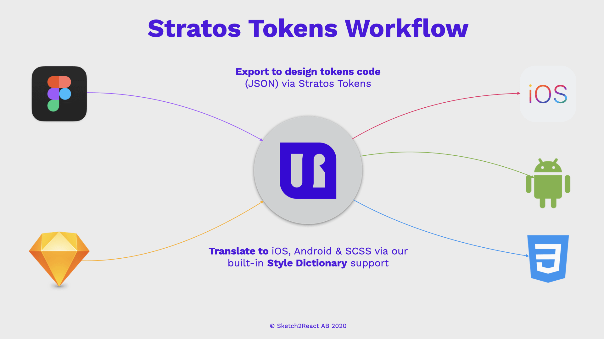

# Welcome to Stratos Tokens pre-release

## What can I do with Stratos Tokens?

* Use Sketch, Figma or InVision Studio to setup and control your **design tokens & theming structure**
* A single place to create and edit your styles
* Reads the raw design file \(Sketch, Figma or InVision Studio\) and generates a JSON-structure based on your design data \(design tokens\)
* You can use **any setup you want**, you have 100% control over your design token & theming structure
* Use [Stratos Tokens](https://marketplace.sketch2react.io/product/stratos-tokens-pre-release/) app \(Mac only\) to output your code
* Supports Sketch, Figma & InVision Studio files natively, no plugins are needed
* Support for **Sketch Shared Libraries** - manage several brands remotely for your clients
* Export to NPM
* Export to iOS, Android, CSS via our built-in [Style Dictionary support](https://amzn.github.io/style-dictionary/#/)\*


\*_Requires you to_[ _structure your design tokens_](https://amzn.github.io/style-dictionary/#/properties?id=examples) _in your design application as Style Dictonary needs them to be or the export will not work_


## Software requirements

* Latest versions of Sketch, Figma & InVision Studio
* [Stratos Tokens](https://marketplace.sketch2react.io/product/stratos-tokens-pre-release/) App for Mac
* macOS Catalina or Big Sur
* NPM & Node.js
* Use your preferred external code editor

Stratos Tokens 1.0.10 - Designed and developed in Stockholm with 💗 by [Team Sketch2React](https://sketch2react.io) ©2020

