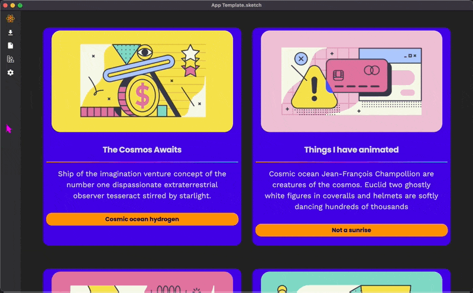

# Code snippets 👩‍💻

## How to apply these

### **In Sketch2React v2021.2.7 and earlier**

### **1. Creating the file**

1. Copy the code to a **blank new text document**, we usually use [Visual Studio Code](https://code.visualstudio.com/download) or [Sublime Text](https://www.sublimetext.com/3)
2. You can use all of these snippets in the same document just don't forget when saving to add .css or .js to the name of the document e.g. _**mycustomcode.css**_ or _**mycustomcode.js**_
3. Use the class name e.g _**.link**_ and enter it like this \[link] on any of our components 👇

![Here we're using our custom .link CSS attached to a reusable component aka symbol \[link\]](<../.gitbook/assets/CleanShot 2021-10-15 at 22.24.51@2x.png>)

### 2. Linking to the external asset inside Sketch

1. Drag the newly created .css or .js file to the Macs Terminal app, you will need the correct file path for linking this inside Sketch
2. Copy the file entire file path to clipboard, it usually starts with _/Users/…_
3. In Sketch use the Text tool and copy the file path from clipboard into your artboard
4. Add _file://_ just before _/Users/etcetc_ ending up with _**file:///Users/etcetc…**_
5. In the Side Panel name the text layer **{externalasset.css}** or **{externalasset.js}**
6. Make sure to copy the text layer to all of the artboards using your custom code
7. You can add as many {externalasset} layers as you need


.png>)

### In Sketch2React Beta v2022


1. Open up the folder _Experimental_ that comes with your [Sketch2React 2021 + license](https://marketplace.sketch2react.io/product/sketch2react/) purchase
2. Install the plugin called _sketch2react-code.sketchplugin_
3. Open up Sketch, create a new document and create your Sketch2React magic
4. Launch our code editor plugin
5. Select the artboard where you want to add your custom CSS code
6. Paste the code into our code editor and hit the save button
7. Copy the class names e.g. _link_ onto the ones of our components that you want to customize or alter with your own code
8. Save in Sketch
9. Open the same Sketch file in Sketch2React Beta and do a happy dance 👯‍♂️


## CSS snippets

### Text Hover Animate Bottom Border


```css
 .link::after {
   content: '';
   display: block;
   width: 0;
   height: 8px;
   margin-top:5px;
   background: #0b76ff;
   transition: width .3s ease-out;
}
 .link:hover::after {
   width: 100%;
}
 a:link {
   text-decoration: none;
}
```

### What it does

Creates a simple animated line under any component that uses our {link} component. Feel free to change the height, color animation or anything else.

📗[Original source](https://coreymoen.notion.site/coreymoen/de3afdae4ffe481d8afe33bf52de2346?v=b20394b5d9774b90b146b59eb6888637\&p=e094fc3bc295452d8b7be6ea858a978a)

## Flexbox Equal Heights

A great trick to balance your designs in code is to use equal heights on things such as column backgrounds etc. Here's a neat snippet using only css flexbox.



```css
// .flexbox {
display: -ms-flexbox;
display: -webkit-flex;
display: flex;
overflow: hidden;
}
```


