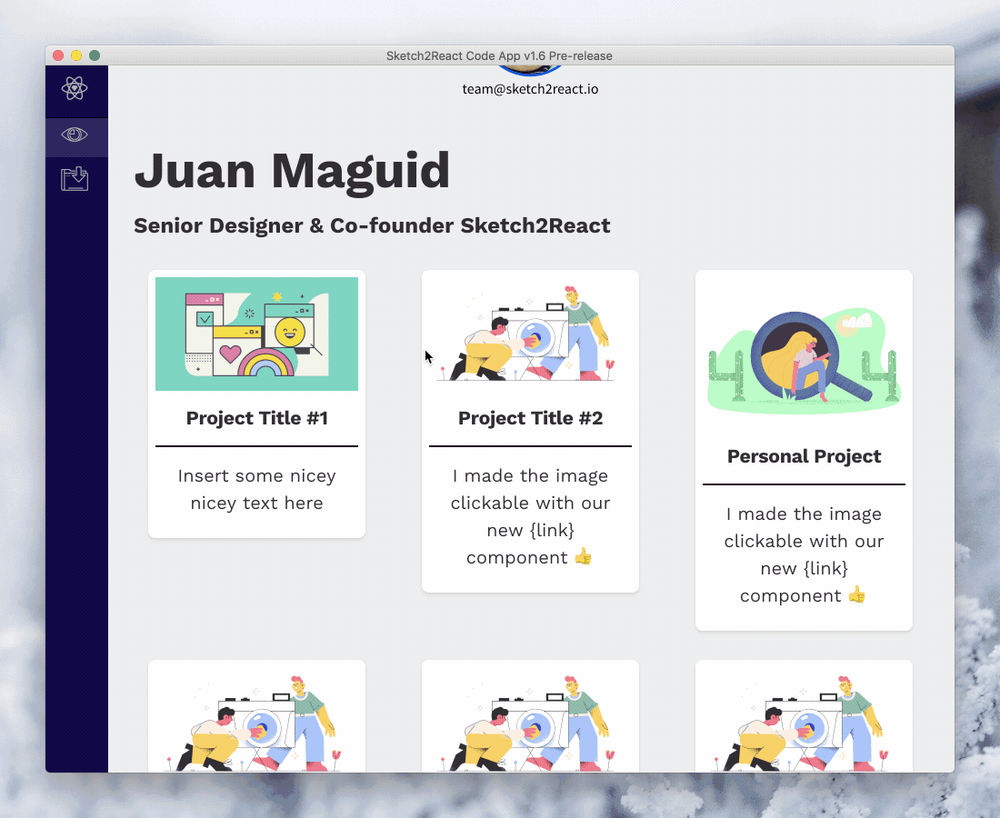

# Components 💎

## **Grid & Layout Components**

These are for setting up grids and layouts in Sketch. You create all of them in Sketch **by creating Groups \(⌘G\) and renaming the groups accordingly.**

### **{container}**


```text
{container}
```

Creates a Bootstrap **Container** element. This is the outermost element in a Bootstrap grid. 


**Note:** You can also have {container} elements inside of {col} elements \(known as nesting\).


**Supports:**

> * classes \[ \]
> * Backgrounds {BG}

**Since:** v0.0.5


#### How to add in Sketch:

1. Create a text node **\(T\)**
2. Group that text node **\(⌘+G\)**
3. Rename group **{container}**
4. Delete text node _or_ name it {text} 


### **{container-fluid}**


```text
{container-fluid}
```

Creates a Bootstrap **Container-fluid** element. This element \(as opposed to {container}\) always covers 100% of the available width \(screensize or, if nested, the width of the parent {col} element\)

#### **Supports:**

> * classes \[ \]
> * Backgrounds {BG}

**Since:** v0.0.5


#### How to add in Sketch:

1. Create a text node **\(T\)**
2. Group that text node **\(⌘+G\)**
3. Rename group **{container-fluid}**
4. Delete text node _or_ name it {text} 


### **{row}**

```text
{row}
```

Creates a Bootstrap **Row** element. A {row} is a direct child to {container} or {container-fluid}. This element's height is always at least as high as the corresponding element in the Sketch document.

#### **Supports:**

> * classes \[ \]
> * Backgrounds {BG}


#### **Pro tip!** 

By adding the Bootstrap 4 class _no-gutters_ you will remove gutters from child {col}. 

Example:

#### {row} \[no-gutters\]


**Since:** v0.0.5


#### How to add in Sketch:

1. Create a text node **\(T\)**
2. Group that text node **\(⌘+G\)**
3. Rename group **{row}**
4. Delete text node _or_ name it {text} 


### **{col}**

```text
{col}
```

Creates a Bootstrap **Column** element. A {col} is a direct child to {row}. {col} can contain {container} or {container-fluid} elements \(Known as nesting\). It is within this element you place all your content.

**Supports:**

> * classes \[ \]
> * Backgrounds {BG}

**Since:** v0.0.5


#### How to add in Sketch:

1. Create a text node **\(T\)**
2. Group that text node **\(⌘+G\)**
3. Rename group **{col}**
4. Delete text node _or_ name it {text} 


### **{group}**

`{group}` 

This is a **structural component** used as a helper to align it’s child-elements \(vertically or horizontally\). It supports classes, but not Sketch-styling.

#### Horizontally:

If you, within a {group} place X number of Sketch2React elements next to each other horizontally, {group} will make sure they end up horizontally in code. They will also be automatically centered vertically.

The remaining space \(the difference/delta between the child-elements total width and the {group}’s own width\) will be distributed evenly **between** the children.

#### Vertically:

If you, within a {group} place X number of Sketch2React elements stacked vertically in Sketch, {group} will make sure they end up vertically in code. 

The remaining space \(the difference/delta between the child-elements total height and the {group}’s own height\) will be distributed evenly **between** the children. 

**Supports:**

> * classes \[ \]

**Since:** v0.6.0

### {group-fixed}

`{group-fixed}`

This element is identical to {group} except that it always keeps the same width \(taken from Sketch\) even when you resize it’s parent component \(e.g. a {col}\). 


**Note!** {group-fixed} is never wider that the size of it's parent element. 


**Supports:**

> * classes \[ \]

**Since:** v0.6.0

### {div}

A generic component well suited for implementing things such as other grid systems \(e.g. [MaterialUI grid](https://www.muicss.com/)\) or construct your own components!

**Since:** 1.6.4 pre-release

## Basic Components

These are for common design tasks such as texts, images & backgrounds. You create all of them in Sketch **by using the Shape Tools. Images you import.**

### **{text}**

```text
{text}
```

The text-layers created in Sketch needs to be named {text} in order for the code app to find them and parse them properly. By default {text} generates an HTML paragraph tag.

You can set which kind of HTML element should be created by specifying e.g. _{text.span}_. Available types are:

**{text.p}** \(same as default {text}\) - This creates an HTML paragraph tag

```text
{text.p}
```

**{text.span}** - This creates an HTML span tag

```text
{text.span}
```

**Supports:** Text styles

### **{image}**

```text
{image}
```

Creates an image with a responsive size. It scales according to available width.

**Supports:**

> * classes \[ \]

**Since:** v0.0.5


**ProTip!** Make sure to export/reimport your assets at the @2x resolution so that you don't get fuzzy edges on retina resolution screens.


### **{image-fixed}**

```text
{image-fixed}
```

Host images, GIFs and even animated SVGs externally. Download [these .sketchfiles](https://www.dropbox.com/sh/6c4bs8f9tv45ckg/AAAJtI44NWsmbBhXie1KO1P0a?dl=0) and grab the component

**Supports:**

* classes \[ \]

**Since:** v2021.2.7

Creates an image with fixed width and height \(taken from Sketch\).

**Supports:**

> * classes \[ \]

**Since:** v0.0.5

### {image-external}

```text
{image-external}
```

### {rectangle}


```text
{rectangle}
```

Creates a HTML-div element that is 100% of it's parent elements height and 100% width of it's parent element. This element's height is always at least as high as the corresponding element in the Sketch document.


By adding the Bootstrap class \[rounded-circle\] to the {rectangle} you'll get a rounded circle.


```text
{rectangle} [rounded-circle]
```

This is a Sketch "Rectangle"-Shape


**Pro tip!** This is an awesome way to create responsive wireframes 🎉


**Supports:**

> * classes \[ \]

**Since:** v0.0.55

### **{BG}**

```text
{BG}
```

Can be a rectangle or an image. 


**Pro tip!** Fill the {BG} with a nice linear gradient for really nice website backgrounds that are super lightweight in size. Use {container-fluid} and put the {BG} like below:



**Since:** v0.0.5

**Supports:** Layer styles

### {oval}

```text
{oval}
```

Using the **O** inside of Sketch you can create an oval element.

**Supports:**

> * classes \[ \]

**Since:** v0.60

## **Interactive Components**

These are all of our interactive components like buttons, navigation, forms. These are a bit more complex but still use only native Sketch tools. **Please refer to our many demo files and study our interactive components.**

### **{button-primary} \(Symbol\)**

```text
{button-primary}
```

Creates a Bootstrap primary button element. You need to use the symbol _Primary-button_ from the Sketch demo-document!

**Supports:**

> * classes \[ \]
> * Backgrounds {BG}

**Since:** v0.0.5

### **{button-secondary} \(Symbol\)**

```text
{button-secondary} 
```

Creates a Bootstrap secondary button element. You need to use the symbol _Secondary-button_ from the Sketch demo-document!

**Supports:**

> * classes \[ \]
> * Backgrounds {BG}

**Since:** v0.0.5

### {button-submit} \(Symbol\)

```text
{button-submit} 
```

Creates a Bootstrap-style submit button. This is used for {form}.

**Supports:**

> * classes \[ \]
> * Backgrounds {BG}

**Since:** v0.0.55

### **Form \(Symbol\)**

Creates an HTML-form. Use the Form-symbol from the demo-document as reference.

**Since:** v0.0.55

### **{form}**

Use the Form-symbol from the demo-document as reference.

**contains:** {button-submit}, {form-group}, {attribute.action}, {attribute.method}

```text
{form}
```

**Since:** v0.0.55

### **{form-group}**

Use the Form-symbol from the demo-document as reference.

**contains:** {text}, {input}

```text
{form-group}
```

**Since:** v0.0.55

### **{input} \(Symbol\)**

Creates an HTML text-input field.

**Supports:**

> * classes \[ \]
> * Backgrounds {BG}

**Since:** v0.0.55

### **{navbar-light}**

```text
{navbar-light}
```

Creates a Bootstrap Navbar element. 

**contains:** {nav}

**Supports:**

> * classes \[ \]
> * Backgrounds {BG}
> * Breakpoints \(xs, sm, md, lg, xl\) See cheetsheet for details.

**Since:** v0.0.5

**Updates:** v0.0.55 - Now possible to style

### **{navbar-dark}**

```text
{navbar-dark}
```

Creates a Bootstrap Navbar element.

**contains:** {nav}

**Supports:**

> * classes \[ \]
> * Backgrounds {BG}
> * Breakpoints \(xs, sm, md, lg, xl\) See cheetsheet for details.

**Since:** v0.0.5

**Updates:** v0.0.55 - Now possible to style

### **{nav}**

```text
{nav}
```

Creates a Bootstrap Nav element. Contains one or more {nav-item} and {nav-item-active} elements.

**contains:** {nav-item}, {nav-item-active}

**Supports:**

> * classes \[ \]
> * Backgrounds {BG}

**Since:** v0.0.5

**Updates:** v0.0.55 - Now possible to style

### **{nav-item} \(Symbol\)**

```text
{nav-item}
```

Creates a navigation-link \(HTML \[a\] tag\). You need to use the symbol _nav-item_ from the Sketch demo-document!

**Since:** v0.0.5

**Updates:** v0.0.55 - Now possible to style

### **{nav-item-active} \(Symbol\)**

```text
{nav-item-active}
```

Creates an active-style navigation-link \(HTML \[a\] tag\). You need to use the symbol _nav-item-active_ from the Sketch demo-document!

**Since:** v0.0.5

**Updates:** v0.0.55 - Now possible to style



### {link} \(Symbol\)

```text
{link}
```

Link component that give you the ability to link anything to anywhere.

**Since:** v1.6.3 pre-release

## Animation Components

These are all of our **animation components** that really expands what you can do with our framework in forms of interactivity.

### {Haiku} \(Symbol\)

Enables the ability to add interactive animations made with [Haiku Animator](https://www.haikuforteams.com/) to Sketch2React.

**Since:** v1.5

### {Lottie} \(Symbol\)

Enables the ability to add interactive animations made in the [Lottie animation](https://lottiefiles.com/) format.

**Since:** v1.5

## Other

Here's those that are hard to categorise 😸🌵

### **{externalasset.css}**

```text
{externalasset.css}
```

Links to external assets such as fonts or your own custom style-sheets.


#### How to add in Sketch:

1. Create a text node **\(T\)**
2. Rename text node in the Layer List to **{externalasset.css}**
3. In the text node itself, enter the url to the external asset
4. Copy+paste this to each page that uses the external assets 


**When in doubt, use the demo document as a reference :\)**

**Since:** v0.0.5

### **{externalasset.js}** <a id="5084"></a>

It is now possible to add your own javascript-files to your HTML-exports. This adds a new dimension of interactivity to your HTML-exports!

**Since:** v1.6.3 pre-release

### Fluid fonts


**Pro tip!** By adding the class _js-font-fluid-12_ you will have fluid font-size. The last part \(12\) refers to the number of px the font will span between. This is also dependent of the artboard size.


#### First example

* You have a mobile-size artboard \(576px wide\).
* You have a {text} with font-size 18px.
* You have a {text} with the class _js-font-fluid-10_ 

```text
{text} [js-font-fluid-10]
```

The font-size will then flow between 18px at the smallest screen-size and 28px at the largest screen-size.

#### **Second example**

* You have a desktop-size artboard \(&gt;576px wide\).
* You have a {text} with front-size 18px.
* You have a {text} with the class _js-font-fluid-12_

```text
{text} [js-font-fluid-12]
```

The font-size will then flow between 6px at the smallest screen-size and 18px at the largest screen-size.

**Supports:**

> * classes \[ \]

**Since:** v0.0.5

**Updates:** v0.0.55 - Fluid font support


