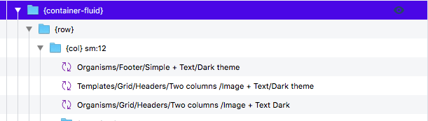
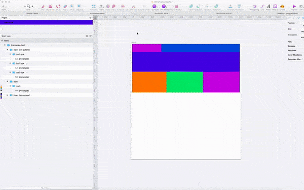

# Components 💎


## **{container}**


```text
{container}
```

Creates a Bootstrap Container element. This is the outermost element in a Bootstrap grid. 


**Note:** You can also have {container} elements inside of {col} elements \(known as nesting\).


**Supports:**

> * classes \[ \]
> * Backgrounds {BG}

**Since:** v0.0.5

## **{container-fluid}**



```text
{container-fluid}
```

Creates a Bootstrap Container-fluid element. This element \(as opposed to {container}\) always covers 100% of the available width \(screensize or, if nested, the width of the parent {col} element\)

#### **Supports:**

> * classes \[ \]
> * Backgrounds {BG}

**Since:** v0.0.5

## **{row}**

```text
{row}
```

Creates a Bootstrap Row element. A {row} is a direct child to {container} or {container-fluid}. This element's height is always at least as high as the corresponding element in the Sketch document.

#### **Supports:**

> * classes \[ \]
> * Backgrounds {BG}


**Pro tip!** By adding the Bootstrap 4 class _no-gutters_ you will remove gutters from child {col}. 

Example:

{row} \[no-gutters\]


**Since:** v0.0.5

## **{col}**

```text
{col}
```

Creates a Bootstrap Col element. A {col} is a direct child to {row}. {col} can contain {container} or {container-fluid} elements \(Known as nesting\). It is within this element you place all your content.

**Supports:**

> * classes \[ \]
> * Backgrounds {BG}

**Since:** v0.0.5

## **{text}**

```text
{text}
```

The text-layers created in Sketch needs to be named {text} in order for the previewer app to find them and parse them properly. By default {text} generates an HTML paragraph tag.

You can set which kind of HTML element should be created by specifying e.g. _{text.span}_. Available types are:

**{text.p}** \(same as default {text}\) - This creates an HTML paragraph tag

```text
{text.p}
```

**{text.span}** - This creates an HTML span tag

```text
{text.span}
```

## Fluid fonts


**Pro tip!** By adding the class _js-font-fluid-12_ you will have fluid font-size. The last part \(12\) refers to the number of px the font will span between. This is also dependant of the artboart size.


#### Example:

* You have a mobile-size artboard \(576px wide\).
* You have a {text} with font-size 18px.
* You have a {text} with the class _js-font-fluid-10_ \( {text} \[js-font-fluid-10\]\)

The font-size will then flow between 18px at the smallest screen-size and 28px at the largest screen-size.

**Another example:**

* You have a desktop-size artboard \(&gt;576px wide\).
* You have a {text} with front-size 18px.
* You have a {text} with the class _js-font-fluid-12_ \( {text} \[js-font-fluid-12\]\)

The font-size will then flow between 6px at the smallest screen-size and 18px at the largest screen-size.

**Supports:**

> * classes \[ \]

**Since:** v0.0.5

**Updates:** v0.0.55 - Fluid font support

## **{image}**

```text
{image}
```

Creates an image with a responsive size. It scales according to available width.

**Supports:**

> * classes \[ \]

**Since:** v0.0.5

## **{image-fixed}**

```text
{image-fixed}
```

Creates an image with fixed width and height \(taken from Sketch\).

**Supports:**

> * classes \[ \]

**Since:** v0.0.5

```text

```

## **{button-primary} \(Symbol\)**

```text
{button-primary}
```

Creates a Bootstrap primary button element. You need to use the symbol _Primary-button_ from the Sketch demo-document!

**Supports:**

> * classes \[ \]
> * Backgrounds {BG}

**Since:** v0.0.5

## **{button-secondary} \(Symbol\)**

```text
{button-secondary} 
```

Creates a Bootstrap secondary button element. You need to use the symbol _Secondary-button_ from the Sketch demo-document!

**Supports:**

> * classes \[ \]
> * Backgrounds {BG}

**Since:** v0.0.5

## {button-submit} \(Symbol\)

```text
{button-submit} 
```

Creates a Bootstrap-style submit button. This is used for {form}.

**Supports:**

> * classes \[ \]
> * Backgrounds {BG}

**Since:** v0.0.55

## **Form \(Symbol\)**

Creates an HTML-form. Use the Form-symbol from the demo-document as reference.

**Since:** v0.0.55

## **{form}**

Use the Form-symbol from the demo-document as reference.

**contains:** {button-submit}, {form-group}, {attribute.action}, {attribute.method}

```text
{form}
```

**Since:** v0.0.55

## **{form-group}**

Use the Form-symbol from the demo-document as reference.

**contains:** {text}, {input}

```text
{form-group}
```

**Since:** v0.0.55

## **{input} \(Symbol\)**

Creates an HTML text-input field.

**Supports:**

> * classes \[ \]
> * Backgrounds {BG}

**Since:** v0.0.55

## {rectangle}



```text
{rectangle}
```

Creates a HTML-div element that is 100% of it's parent elements height and 100% width of it's parent element. This element's height is always at least as high as the corresponding element in the Sketch document.


By adding the Bootstrap class \[rounded-circle\] to the {rectangle} you'll get a rounded circle.


```text
{rectangle} [rounded-circle]
```

This is a Sketch "Rectangle"-Shape


**Pro tip!** This is an awsome way to create responsive wireframes 🎉


**Supports:**

> * classes \[ \]

**Since:** v0.0.55

## **{BG}**

```text
{BG}
```

Can be a rectangle or an image.

**Since:** v0.0.5

## **{navbar-light}**

```text
{navbar-light}
```

Creates a Bootstrap Navbar element. 

**contains:** {nav}

**Supports:**

> * classes \[ \]
> * Backgrounds {BG}
> * Breakpoints \(xs, sm, md, lg, xl\) See cheetsheet for details.

**Since:** v0.0.5

**Updates:** v0.0.55 - Now possible to style

## **{navbar-dark}**

```text
{navbar-dark}
```

Creates a Bootstrap Navbar element.

**contains:** {nav}

**Supports:**

> * classes \[ \]
> * Backgrounds {BG}
> * Breakpoints \(xs, sm, md, lg, xl\) See cheetsheet for details.

**Since:** v0.0.5

**Updates:** v0.0.55 - Now possible to style

## **{nav}**

```text
{nav}
```

Creates a Bootstrap Nav element. Contains one or more {nav-item} and {nav-item-active} elements.

**contains:** {nav-item}, {nav-item-active}

**Supports:**

> * classes \[ \]
> * Backgrounds {BG}

**Since:** v0.0.5

**Updates:** v0.0.55 - Now possible to style

## **{nav-item} \(Symbol\)**

```text
{nav-item}
```

Creates a navigation-link \(HTML \[a\] tag\). You need to use the symbol _nav-item_ from the Sketch demo-document!

**Since:** v0.0.5

**Updates:** v0.0.55 - Now possible to style

## **{nav-item-active} \(Symbol\)**

```text
{nav-item-active}
```

Creates an active-style navigation-link \(HTML \[a\] tag\). You need to use the symbol _nav-item-active_ from the Sketch demo-document!

**Since:** v0.0.5

**Updates:** v0.0.55 - Now possible to style

## **{externalasset.css}**

```text
{externalasset.css}
```

Links to external assets such as fonts or your own custom style-sheets.

**When in doubt, use the demo document as a reference :\)**

**Since:** v0.0.5

## {oval}

```text
{oval}
```

Using the **O** inside of Sketch you can create an oval element.

**Supports:**

> * classes \[ \]

**Since:** v0.60

## Experimental 👨‍🔬👩‍🔬 <a id="experimental&#x1F468;&#x200D;&#x1F52C;&#x1F469;&#x200D;&#x1F52C;"></a>

We have a few more components that are in the experimental stage like cards and stuff! Check out the demo document! We'll keep you updated!

