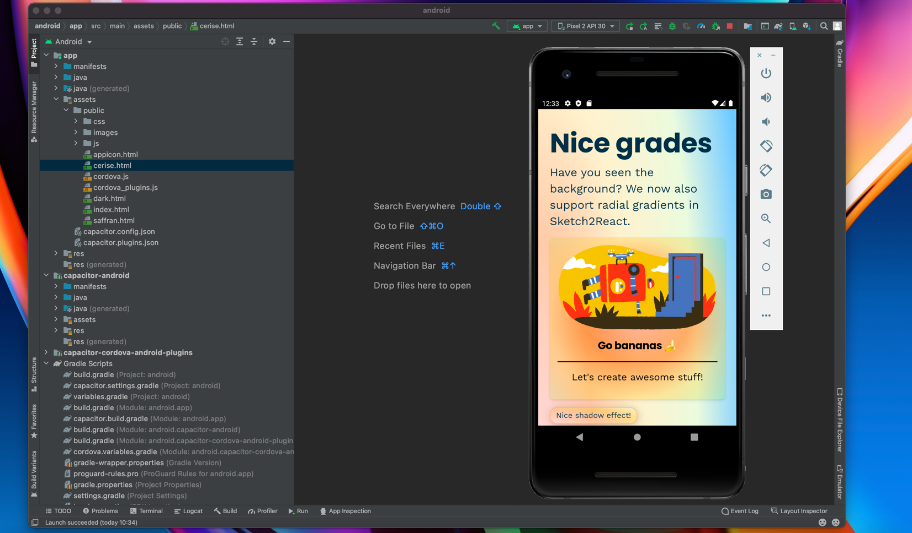

# Exporting to Code 🚚

## Export to Capacitor.js 


You now also can export directly to iOS & Android project via something awesome called [Capacitor.js](https://capacitorjs.com)

1. Make sure you have [all links between pages](https://sketch2react.io/blog/tutorial-from-sketch-to-xcode-the-no-code-way/) working and that you have visited each page once (it gets added to our export bundle that way)
2. Click on the Download button 👉 **Download Capacitor project**
3. Unzip the folder we created for you
4. Make sure you compress the images, we 🧡 [TinyPNG](https://tinypng.com)
5. Drag the entire folder onto e.g., Visual Studio Code
6. Open up a New Terminal in VSC
7. Type `npm install` and hit enter
8. Done!

### Download the latest package.json file

When you export to Capacitor from Sketch2React you get a neat package.json file that holds important stuff like which version of Capacitor to install etc. Problem with that is that since we don't update our apps as often as Capacitor does you may run into errors while installing.

Simple solution? We just make sure we update this file👇 🤖  more often than Sketch2React. Easy peasy. After you have exported to Capacitor, just replace the autogenerated one with this one and you'll be fine as 🍷



### Install Xcode Command Line Tools & CocoaPods

This is **crucial** to do before you go to the next step of installing either the iOS or Android platforms.

* Download and install the **Xcode Command Line tools**. You can do this directly from [within Xcode](https://capacitorjs.com/docs/v3/getting-started/environment-setup) or you can just fire up the mighty Terminal app and add this installation snippet:

```
xcode-select —install
```

* Download and install [CocoaPods](https://cocoapods.org), easiest is just by adding this snippet directly in the Terminal:

```
sudo gem install cocoapods
```

### How to install for iOS

1. **Drag the entire exported folder** onto your preferred code editor, we always use [Visual Studio Code](https://code.visualstudio.com/Download) since it’s really nice (and free 🍬)
2. In VSC 👉  **Terminal** 👉  **New Terminal**
3. Just type `npm install`_` `_and hit enter key
4. You have now installed Capacitor.js onto your project folder 👉 Yes! 💪  Not ready yet though, a couple of easy steps left, carry on soldier
5. Type `npx cap init` and hit enter key. Capacitor will ask you a bunch of stuff, like what you want to call the app, where the www folder is etc. Do what is forced upon you and just be a happy camper 🏕️
6. Now it’s time to do the real magic, installing all the files Xcode needs to automagically convert this to a **.xcode project**
7. Type `npm install @capacitor/ios`_ _and hit enter
8. One would assume you would be ready by now. You are assuming wrong dear Watson
9. Type `npx cap add ios`_ _and hit enter key

Now comes the best command ever, hold on to your shorts or skirts 👇

1. Type `npx cap open ios`_ _and like magic mushrooms Xcode will open up in the background and also open up the very same project you just created 👉  Huzzah!

### How to install for Android



Just follow [these instructions](https://capacitorjs.com/docs/v3/android#adding-the-android-platform).

### Updating the HTML

Say that you have exported from Sketch2React and later add new things/change stuff. Of course you want them updated inside Capacitor also. The easiest workflow is:

1. Update inside Sketch/Lunacy 
2. Make sure you see those changes inside Sketch2React
3. Export as HTML
4. Copy the entire HTML export and overwrite inside the _www_ folder in your Capacitor project
5. Jump back to your code editor (we use VSC) open up a new Terminal and run the following command. Make a happy 👯‍♀️

```
npx cap sync
```

## How to export to React

Follow these instructions to the point and you’ll be exporting to React code and components in super little time. We promise 👍

### Adding things to export

1. Open up **Sketch2React** app. 
2. Go to **File, Link Sketch-file** (⌘L) or just **drag and drop** the Sketch file
3. Your Sketch file needs to have our markup rules (components etc)
4. Before anything can be exported to code, you need to **add each artboard/page to our export bundle.** You do that by visiting each page in your design, it adds itself automagically to our bundle after each page load. _Neat right?_
5. Press **Download** icon
6. Press React and save the .zip somewhere locally on your computer.

### Known issues

**Don’t save to Dropbox, OneDrive or Google Drive.** Or use at your own risk of being really annoyed 😅

Once you begin installing all the packages that are included in our React export, these services will most likely hickup. Or send you automated emails complaining you have to many files 😸

This is because we use [Create React App](https://github.com/facebook/create-react-app) (among other things) and it contains an amazingly amount of really small files. Size-wise we’re talking about approx 220MB of downloaded packages.

**iCloud** seems to be working fine with these many small files, no crash so far and the syncing seems to be working great between computers linked to the same Apple ID.

🏎️ Cool, now let’s move on to the really exciting part…

Now comes a couple of steps that first can seem very odd and very unfamiliar. Specially if you have never installed thingies via the Terminal. We have streamlined this as much as we can but hey, this is a real design to code environment, you can’t cheat your way through this 😸

## 🖐️ Node.js

For our **React export** to work you first need to install **Node.js**.

* Node.js is an open source server environment
* Node.js is free
* Node.js runs on various platforms (Windows, Linux, Unix, Mac OS X, etc.)
* Node.js uses JavaScript on the server

Download the latest build [from here](https://nodejs.org/en/download/)

## How to export to React (Terminal)

First of all, make sure you have **admin rights** to your computer or nothing of the below things will ever work. 

1. Open **Terminal app**. You know that weird little app you maybe have been in contact with when doing funky stuff to your Mac 😆 It’s actually really friendly, don’t be afraid. But weird yes.
2. Write **cd **and do a blank space
3. Go to your dl Sketch2React .zip, unzip and drag drop the entire folder onto your Terminal window. Drop it precisely after the words cd + your blank space. It should look something like this cd /users/
4. Hit Enter **↩︎**

## How to install all required packages (Terminal)

1.  Write **npm install** and hit enter **↩︎**
2. Since you have entered the correct cd installation of all required packages should begin

## How to start your development server (Terminal)

1. Write **npm start** and hit enter **↩︎**
2. It will take up to one minute and then you will see this message in the Terminal will open up your default browser with localhost:3000
3. Done! Now continue with your development outside of Sketch, do all changes directly in code.

## How to create a build (Terminal)

* If the server is running, press **Control+C** to stop it


You can’t create a build while the server is running!


* Write **npm run build** and hit enter **↩︎**

It will create a optimized build of your entire project. It takes a bit of time, just chill, stand up, look out your window or something 😄

## Building for Relative Paths

By default, **Create React App** produces a build assuming your app is hosted at the server root.


Here’s how you [change that](https://facebook.github.io/create-react-app/docs/deployment#building-for-relative-paths). 


Open up** package.json** and enter this very path below version:

```
"homepage": "http://mywebsite.com/relativepath",
```


## Export to HTML


1. First of all, make sure you _visit each and every page_ within our code app that you want to be included in your **Export Bundle. **Wait for the **Your Artboard was added to the export bundle **message to appear, it will take a few seconds per artboard, we're just making sure all the good stuff gets included 😺
2. Go to the **Side Bar** in our app and click **Download**
3. Save to great place
4. You know have a **.zip file** with all of your files, assets neatly organized in separate folders
