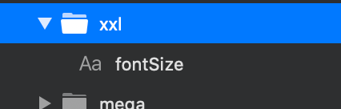
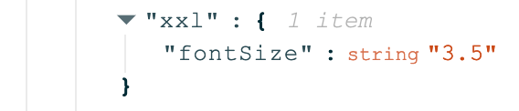
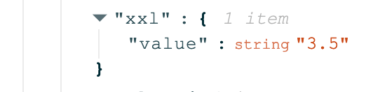
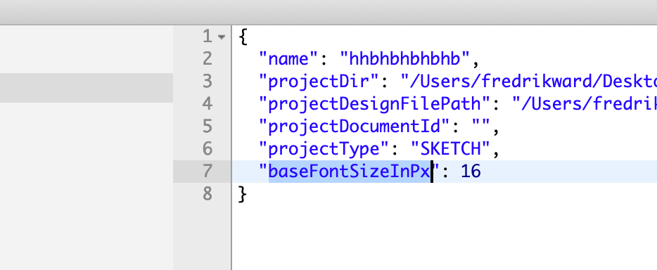

# Releases ✍️

## 1.0.5 - 2020-04-20

### Changes:

* The Stratos Tokens output of _Texts_ and _Rectangles_ which have names matching a CSS property is changed **from** displaying the property name e.g. _fontSize_

**to** displaying _value_

This change is made to better match the expected input of Style Dictionary.

* All values defined in px such as font size, line height etc in _Sketch_, _Figma_ and _InVision Studio_ is now translated into unitless values \(with a [base of 16px](https://learnui.design/blog/mobile-desktop-website-font-size-guidelines.html)\). E.g. 72px / 16 = 4.5 This will be translated by Style Dictionary into platform specific units during Style Dictionary's build process. You can change to another base value by, in the ._stratosproject_ file, change the property _baseFontSizeInPx_

\*\*\*\*

## 1.0.2 - 2020-03-20

### Added:

* Style Dictionary integration to support export to web, mobile and desktop
* Support for Figma
* Support for InVision Studio
* Support for variables in text nodes **{**color.base.primary.value**}** \(specified as **{{**color.base.primary.value**}}**\) in your design tool. This is used to reuse values in Style Dictionary
* New menu item “File &gt; Open project in Terminal”
* Artboards can now be named anything and will still be considered as “Token artboards”. Previously only artboards named “Template” were considered for design token generation. \(You still need an artboard named _**Start**_\)

### **Fixes:**

* Bugfixes to the _Explorer view_.

