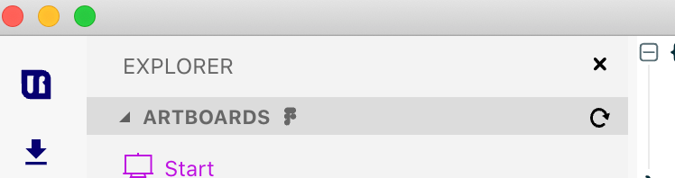
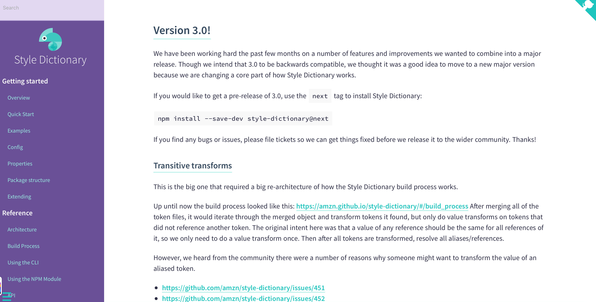
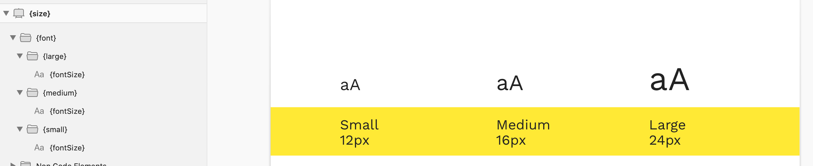
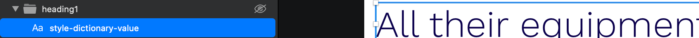
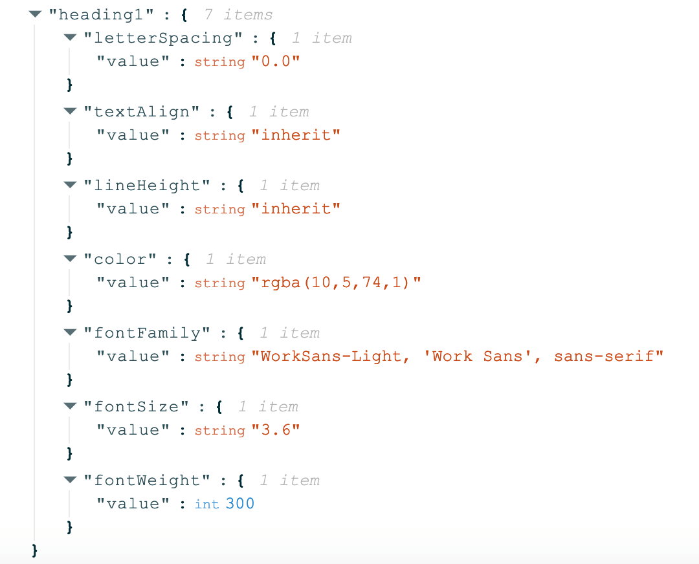

# Releases ✍️

## 2022.4.1 | 2022-10-28

### Added

* A new file explorer(!)
* Support for arrays
* Support for output transformations
* Support for preserving design file units

### Fixes

* Bugfixes
* Minor UI improvements

## 2021.9.0 | 2021-11-20

### Fixes

* It's now possible to activate/deactivate the app again
* Stratos Tokens now supports the latest version of Style Dictionary
* Minor UI improvements

## 2021.7.0 | 2021-06-22

### Added

Figma support 🥳&#x20;

* Please note that _Figma_ files does not support hot-reload like _Sketch_-files do. Instead you need to press the refresh button next on the far right on the _Artboards_ header in the _Explorer_ panel.
* Please note that we currently **don't support creating shadow tokens via Figma**.

### Fixes

Minor UI improvements

## 2021.4.5 | 2021-06-01

### Added

#### Improved NPM export

In addition to containing _Stratos token's_ design tokens, the NPM export now also includes files generated by _Style Dictionary_. It reads _Style Dictionary's_ config file looking for platforms **s**_**css**_, _**less**_, _**css**_ and _**js**_.

* **scss** - _Style Dictionary_ scss variables can be imported by _@import "node\_modules/\[your-package-name]/scss/\_variables.scss"_ by default.
* **less** - _Style Dictionary less_ variables can be imported by _@import "node\_modules/\[your-package-name]/less/\_variables.less"_ by default.
* **css** - _Style Dictionary_ css variables can be imported by _@import "node\_modules/\[your-package-name]/css/\_variables.css"_ by default.
* **js** - _Style Dictionary_ javascript variables can be imported from _"\[your-package-name]/js"_ by default.
* **stratos** - _Stratos Tokens_ javascript variables (found in _\[Your Stratos Tokens project]/data/js_) can be imported from_"\[your-package-name]/stratos"_ by default.

#### Improved Style Dictionary export

We have enhanced our _Style Dictionary_ export to output the following formats: _android, ios, ios-swift, css, js, json, less, react-native, scss, sketch-palette._

### Fixes

Minor UI improvements

## 2021.3.0 | 2021-05-08

### Added

* Support for [Style Dictionary 3.0](https://amzn.github.io/style-dictionary/#/version\_3)
* Download link to our Sketch assistant in the Help menu

### Fixes

* Cleaned up the Design Token view
* Cleaned up README view
* Minor UI improvements

## 2021.2.0 | 2021-04-20

### Added

* You can now name your **Texts** and **Rectangles** as css properties (e.g. fontSize) and only that value will be displayed in Stratos Tokens App.&#x20;

_Please note that the matching css property will be named "value" in Stratos Tokens App. This is to better match the expected input of Style Dictionary._

Supported css properties for **Text layers** are:

*
  * color
  * &#x20;fill (is always transparent for text layers)
  * &#x20;fontFamily&#x20;
  * fontSize&#x20;
  * fontWeight&#x20;
  * lineHeight&#x20;
  * letterSpacing&#x20;
  * opacity

.png>)

_Please note that the matching css property will be named "value" in Stratos Tokens App. This is to better match the expected input of Style Dictionary._

Supported css properties for **Rectangles with borders** are:

*
  * weight
  * color&#x20;
  * radius

## 2021.1.10 | 2021-04-08

### Added

* Support for a more visual way of outputting design tokens for **breakpoints**, **spacing**, **padding** etc - use the width of the line tool
* Support for multiple **shadows** - just add shadows to rectangles
* No more need for a page named Start here and an artboard named Start
* [Demo version](https://marketplace.sketch2react.io/product/stratos-tokens-demo/) of Stratos Tokens
* Windows version
* Dark mode support
* We now have a little 🕵️‍♀️ that helps you re-link your designfile if you have moved it&#x20;
* Possibility to register a bug from within the app
* Extended help menu containing links to documentation, tutorials and more

### Breaking changes

* **Use { } for all your design tokens (artboards + layer + group names)** – mix them with regular design elements

## 1.0.10 | 2020-11-30

### Added

* Big Sur support

## 1.0.8 | 2020-05-13

### Added:

* A 10:th rule to Stratos Tokens. You can now name a Text Layer _style-dictionary-value_ to get the following output in Stratos Tokens App:

.png>)

## 1.0.7 - 2020-05-05

### Added:

* Support for Sketch symbols
* Previously, in Stratos Tokens, you were "bounced back" to _**Start**_ artboard every time your design file changed/updated. This is no longer the case.&#x20;

### Fixes:

* Sketch, Figma and InVision projects are now displayed on the start screen
* Fixed minor type-o:s

## 1.0.6 | Never

This is not the version your looking for... \*Jedi hand move\*

## 1.0.5 | 2020-04-22

### Changes:

_Explorer view_ is now visible from the start.

### FIxes:

* Updated in-app documentation links.
* Artboards in _Explorer view_ are now sorted alphabetically.

## 1.0.4 | 2020-04-20

### Changes:

* The Stratos Tokens output of _Texts_ and _Rectangles_ which have names matching a CSS property is changed **from** displaying the property name e.g. _fontSize_

**to** displaying _value_

This change is made to better match the expected input of Style Dictionary.

* All values defined in px such as font size, line height etc in _Sketch_, _Figma_ and _InVision Studio_ is now translated into unitless values (with a [base of 16px](https://learnui.design/blog/mobile-desktop-website-font-size-guidelines.html)). E.g. 72px / 16 = 4.5 This will be translated by Style Dictionary into platform specific units during Style Dictionary's build process. You can change to another base value by, in the ._stratosproject_ file, change the property _baseFontSizeInPx_

### **Added:**

* New demo file (.sketch, .fig, .studio) for getting started with [Ant Design System ](https://ant.design)to work with our Style Dictionary support

## 1.0.2 | 2020-03-20

### Added:

* Style Dictionary integration to support export to web, mobile and desktop
* Support for Figma
* Support for InVision Studio
* Support for variables in text nodes **{**color.base.primary.value**}** (specified as **\{{**color.base.primary.value**\}}**) in your design tool. This is used to reuse values in Style Dictionary
* New menu item “File > Open project in Terminal”
* Artboards can now be named anything and will still be considered as “Token artboards”. Previously only artboards named “Template” were considered for design token generation. (You still need an artboard named _**Start**_)

### **Fixes:**

* Bugfixes to the _Explorer view_.
