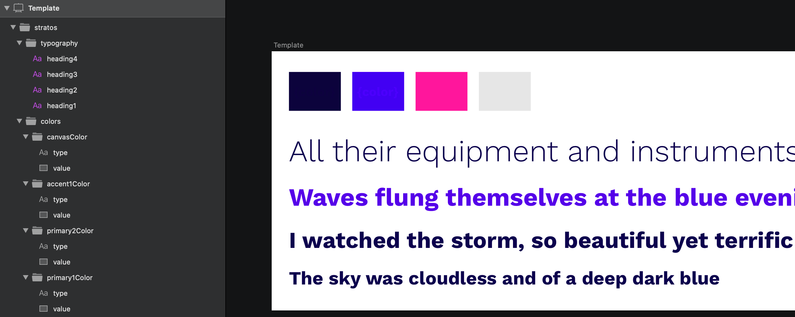
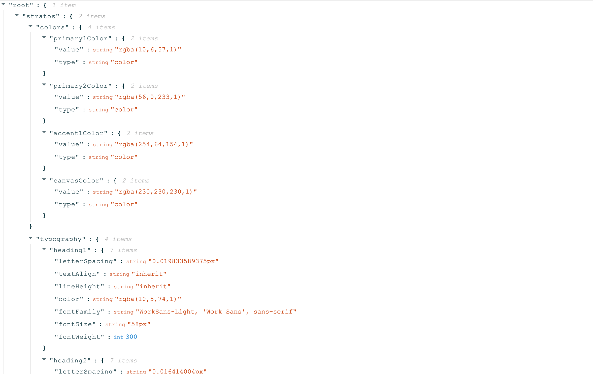
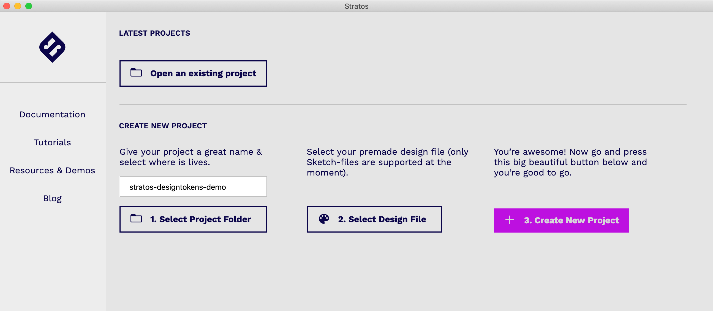
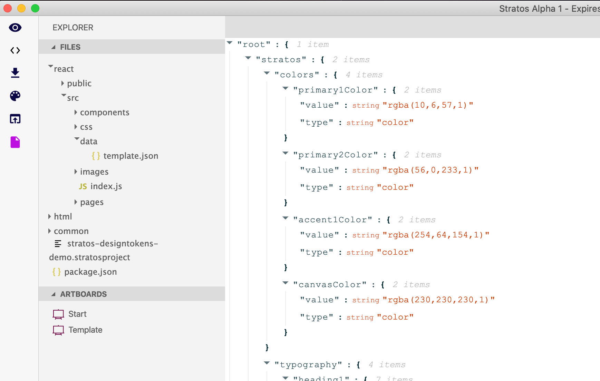
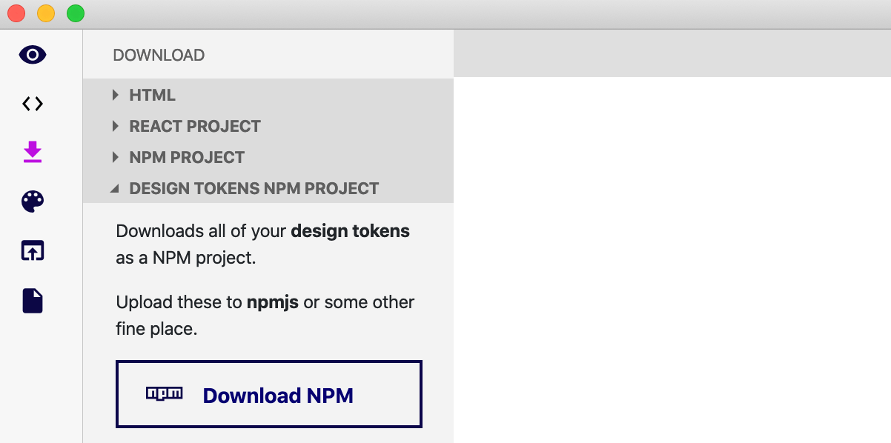

# Stratos Design Tokens

**TLDR;** _Stratos App_ reads the raw design file \(no plugins\) and generates a design token file \(JSON-format\). This file can then be either stored directly in your codebase or uploaded to repositories like _NPMjs_ to be consumed by any codebase on any platform. And it’s 1:1 with your design file!

You visually represent your Design Tokens in a design tool \(currently only _Sketch App_ is supported, but _Figma_ is soon available as well\).



_Stratos App_ reads your design file \(without plugins, yupp, just like that\) and generates a file with a JSON structure containing your design data. Then you either save the design data file \(Design Tokens\) or upload it to a repository like _NPMjs_.




The structure of the output JSON is a direct reflection of the structure in your design document.


Please note that above is just an **example** of how to structure your Design Tokens. It’s up to you to create your own structure.

## A couple of rules to follow

There are **five design rules** that you **need to follow.**

1. The structure of nested Groups in the design document defines the structure of the output JSON data
2. Rectangles represent a color value based of the rectangle’s fill value
3. Text layers represent text formatting
4. Text layers with values within _**{ }**_ are evaluated
5. Text layers with values within _**{ }**_ and matches a CSS property will have only that CSS property’s value \(as opposed to plain Text layers which will contain all CSS properties; see bullet 3 above\)

## What do I do next?

You open _Stratos App_ and **create a new project**. To this project you link your design token design file. In this example I will name my project _stratos-designtokens-demo_. You currently need two artboards:

1. One named _Start_ that can be really small and empty
2. One named _Template_. It's on this artboard that you create your design token structure.



You click on the _file explorer_ and select the artboard named _Template_.



This design data structure is now available from **three places**:

* Direct copy/paste
* As a stand-alone file in the project’s _data_ folder.
* Downloadable as _NPM-project \(new feature coming in alpha 2!\)_

## NPM project? Oooh, tell me more…

Ok, sure. There are a few steps, but stay with us, it’s worth it. In the example below our new **design tokens NPM package** is named _stratos-designtokens-demo_. You can name yours whatever you like.👍😄

If you don’t have the time/patience to read through all the steps; here’s the final example package install command:

```text
npm install — save stratos-designtokens-demo
```



### Downloading

1. On the _Download_ tab in _Stratos App_, expand the _Design tokens NPM project_ and hit the _Download NPM_ button
2. Store the project anywhere you like


### Naming your NPM project

1. Open the file _package.json_ in your **downloaded NPM project’s folder** using your favorite code editor
2. Enter a name on line 2 \(this will be the name of the NPM package\)


### Uploading & publishing

1. Open _Terminal App_
2. Go to your **downloaded NPM project’s folder** \(we named ours _npmDTDemo_\)
3. If this is your _first time uploading a package_ to _NPMjs_ you need to _login_
4. Enter _npm login_ and enter your credentials \(you need an account at [www.npmjs.com](https://www.npmjs.com/)\)
5. Enter _npm install_ \(a bunch of texts will flash by, no worries, this is ok\)
6. Enter _npm run build_ \(more text will flash by, this is also ok\)
7. Enter _npm publish_ \(even more ok text\)


Your design tokens are now available for any codebase on any platform! And **it’s 1:1 with your Design tool’s design document!**

