# How it works 🧰

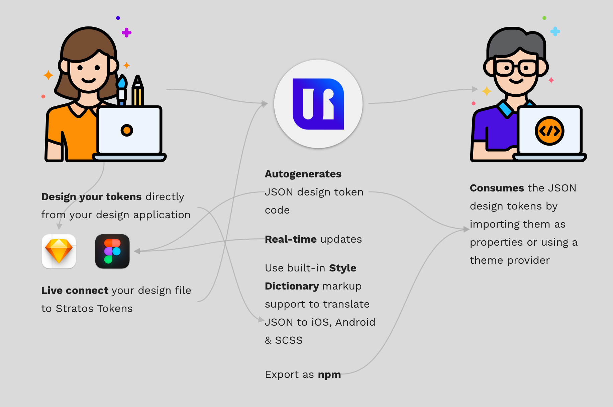

**TLDR;** _Stratos Tokens App_ reads the **raw design file** \(no plugins\) and **generates a design token file** \(JSON-format\). This file can then be either stored directly in your codebase or uploaded to repositories like _NPMjs_ to be consumed by any codebase on any platform. And it’s **1:1 with your design file!**

You visually represent your **Design Tokens** in a design tool, [Sketch](https://www.sketch.com) and [Figma](https://www.figma.com/) are currently supported and we have macOS and Windows versions of our app.

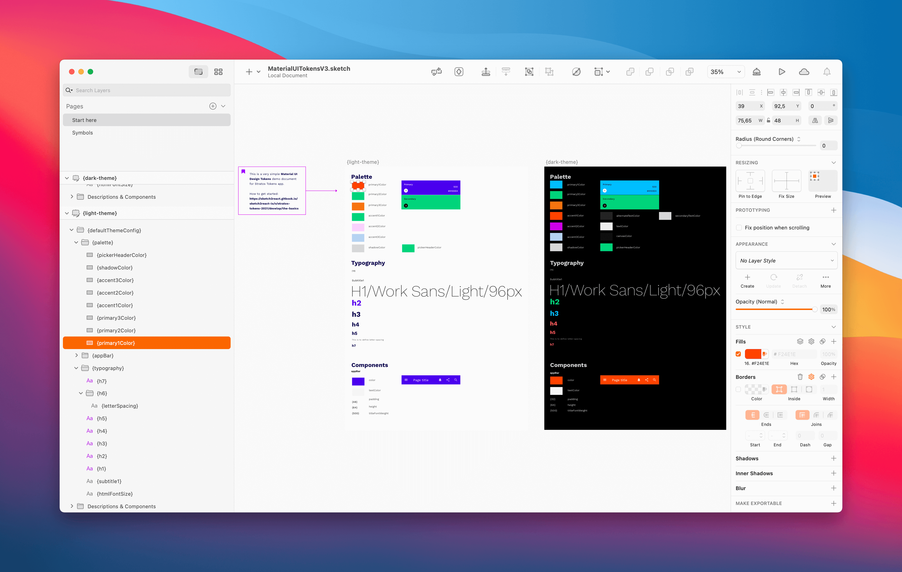

The **Stratos Tokens App** __reads your design file \(without plugins, yupp, just like that\) and generates a file with a JSON structure containing your design data. Then you either save the design data file \(Design Tokens\) or upload it to a repository like _NPMjs_.

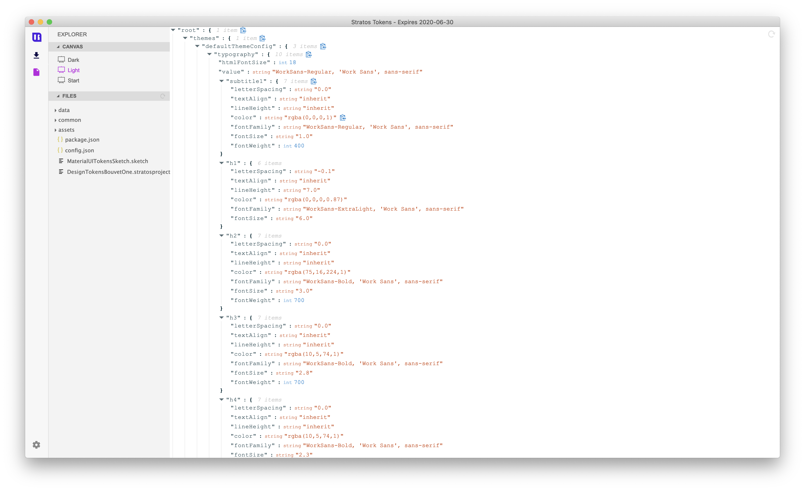


The structure of the output JSON is a direct reflection of the structure in your design document.

🤖👉 _**It’s up to you to create your own structure.**_


Please note that above is just an **example** of how to structure your design tokens & theming. It’s up to you to create your own structure.

## About Style Dictionary

We support [Style Dictionary](https://amzn.github.io/style-dictionary/#/) markup which is a great build system for outputting design tokens to a wide range of different formats. **Support does not mean you can set this up however you want.** You will need to follow Style Dictionary's structure and naming conventions for the auto-translation to do its magic.   
A great article to get you started understanding Style Dictionary is this one.




## How to create design tokens

Basically you use **shapes, lines, layer groups & text nodes** to output design token data. Here's a few great things to know 🤖👇

1. Design token names must be wrapped in **{ }** – including your **design token artboards**
2. The structure of nested Groups \(Sidebar = Sketch, Layers Panel = Figma\) in the design document defines the structure of the output JSON data
3. **Rectangles** represent a **color value** based of the rectangle’s fill value
4. Rectangles without a fill results in **border formatting**
5. **Lines represent width,** perfect for defining **breakpoints**, **spacing & padding**
6. Text layers represent **text formatting**
7. **Text layers with values within { }** are evaluated. Perfect for defining things like **font families, transitions & animation timing**
8. Text nodes with values within **{{ }}** are considered as Style Dictionary references / variables to be able to reuse values. 
9. Text layers with names that matches a CSS property will have only that CSS property’s value \(as opposed to plain Text layers which will contain all CSS properties; see bullet 6 above\)

## What do I do next?

Easiest way to get started with a blank Stratos Tokens project is

### For Sketch

1. Start **Sketch app** and **Create a New document**
2. Create **one artboard**, the size does not matter
3. Give your artboard a simple name, **lower case only, no blank spaces between words** e.g {great-artboard-name}
4. Save your Sketch file to your HD
5. Drag and drop that Sketch file onto our app like in the video below 
6. You are now ready to start creating design tokens straight from inside Sketch app




You click on the _file explorer_ and select the artboard named _Light._

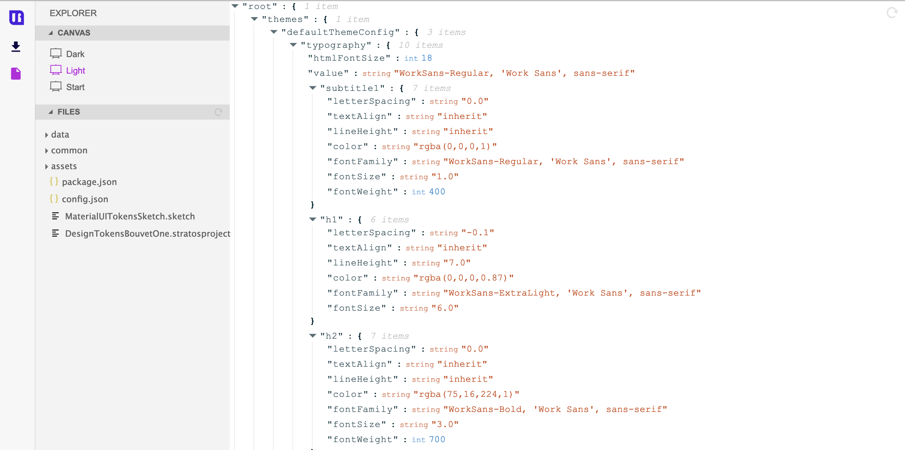

This design data structure is now available from **three places**:

* Direct copy/paste
* As a stand-alone file in the project’s _data_ folder.
* Downloadable as _NPM-project_

### For Figma

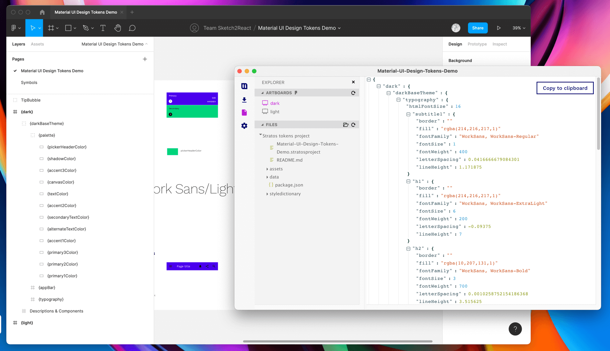

### Get your Figma Access Token

1. Go to your **Figma Account Settings**
2. Scroll down to the bit where it says **Personal access tokens**
3. Create a **new personal access token**
4. **Copy** the access token to notes or something similar

### In Stratos Tokens 2021

1. Go to **Create New Project** and select Figma


2. Paste your newly created Figma access token, no worries you only **need to do this once**, and it can be revoked if needed, more on that later.

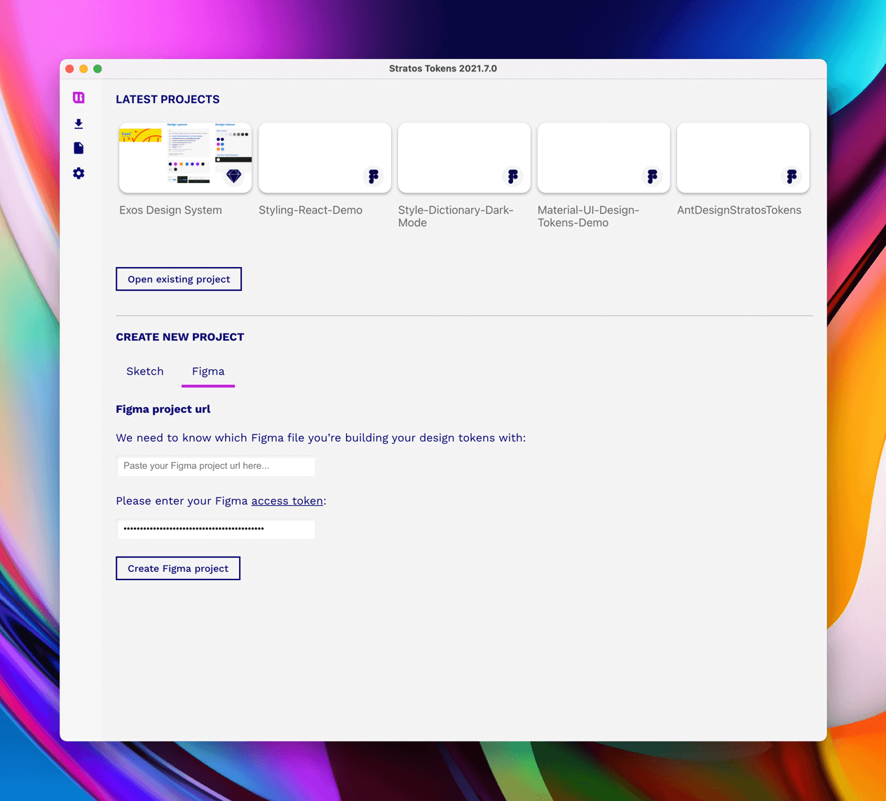

1. Jump back to Figma and **create a new file**
2. Copy the URL of that Figma file 

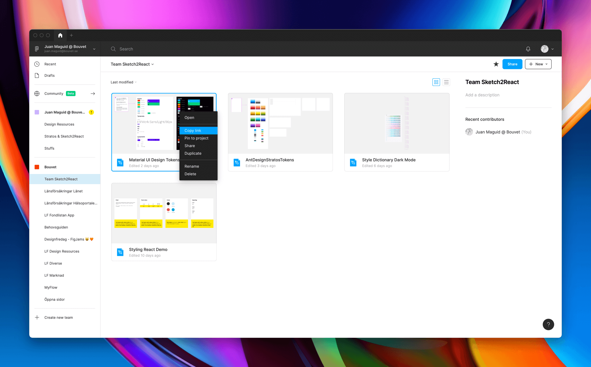

3. Paste the Figma file URL in our app 👉 **Figma project url**

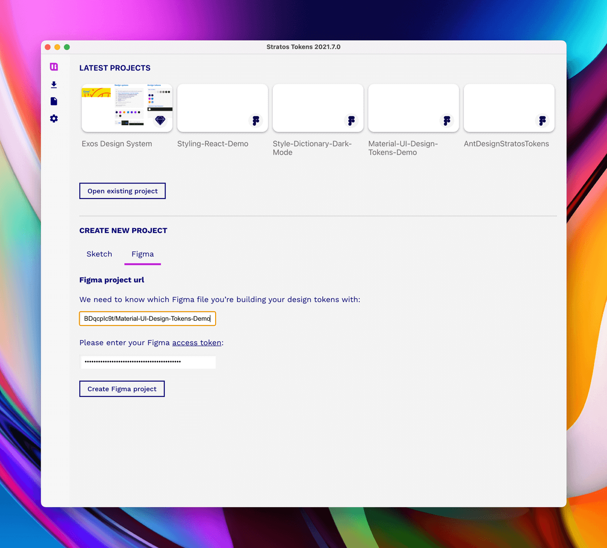

Now we are ready to get going! Press **Create Figma project** 

## Important thing about Figma files

Figma files work differently than Sketch files in the sense that Figma doesn’t offer so called _hot-reloading_. Every time you do changes inside Figma you will need to press the **little reload icon** to update the **design token tree**.

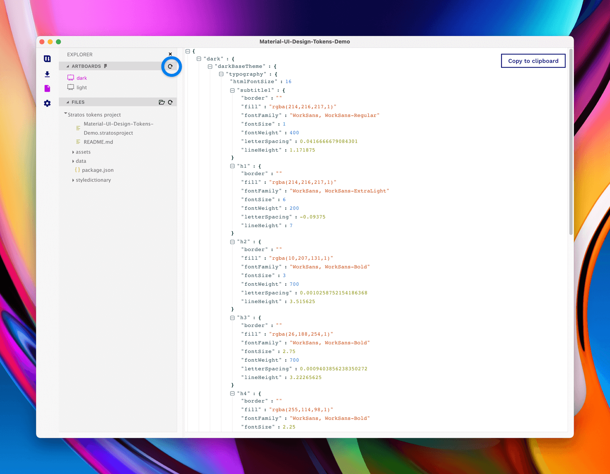

In a future update, we’ll introduce time-saving shortcuts for this and other semi annoying things. Who doesn’t want extra seconds in life?

### When using Auto Layout

If you're using the awesome Auto Layout function in Figma make sure not to break the naming chain or you will break the design token output in Stratos Tokens. 


Design token names must be wrapped in **{ }** – including your **design token artboards**


#### Do Auto Layout like this👇

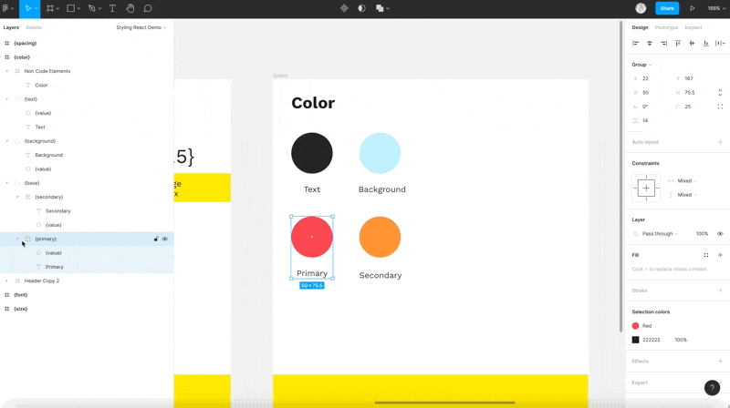

## So, now what?

Now you need to learn **how our app and design token framework works**, what rules you need to follow, how you can set up things, if you’re going to follow our built-in Style Dictionary support or not. We give you the choice.

A great starting point is reading [this article](https://sketch2react.io/blog/the-different-levels-of-design-token-designing/). If you’re curious about learning how to setup for Style Dictionary we suggest you read [this article](https://sketch2react.io/blog/lets-get-practical-with-design-tokens-part-1/).

## NPM project? Oooh, tell me more…

Ok, sure. There are a few steps, but stay with us, it’s worth it. In the example below our new **design tokens NPM package** is named _stratos-designtokens-demo_. You can name yours whatever you like.👍😄

If you don’t have the time/patience to read through all the steps; here’s the final example package install command:

```text
npm install — save stratos-designtokens-demo
```

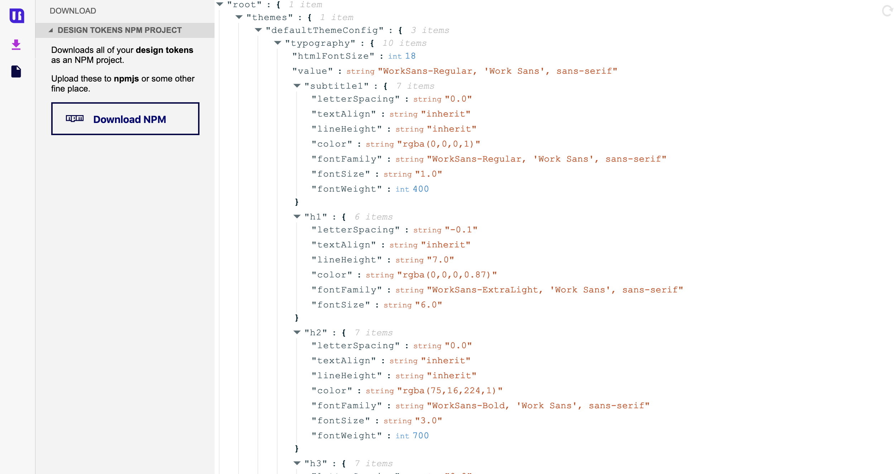

### Downloading

1. On the _Download_ tab in _Stratos Tokens App_, expand the _Design tokens NPM project_ and hit the _Download NPM_ button
2. Store the project anywhere you like

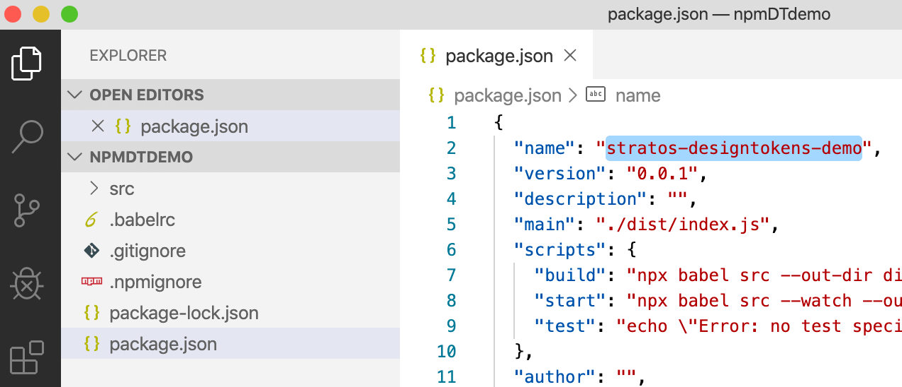

### Naming your NPM project

1. Open the file _package.json_ in your **downloaded NPM project’s folder** using your favorite code editor
2. Enter a name on line 2 \(this will be the name of the NPM package\)

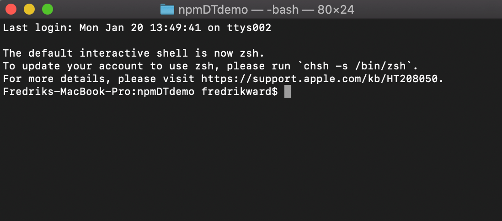

### Uploading & publishing

1. Open _Terminal App_
2. Go to your **downloaded NPM project’s folder** \(we named ours _npmDTDemo_\)
3. If this is your _first time uploading a package_ to _NPMjs_ you need to _login_
4. Enter _npm login_ and enter your credentials \(you need an account at [www.npmjs.com](https://www.npmjs.com/)\)
5. Enter _npm install_ \(a bunch of texts will flash by, no worries, this is ok\)
6. Enter _npm run build_ \(more text will flash by, this is also ok\)
7. Enter _npm publish_ \(even more ok text\)

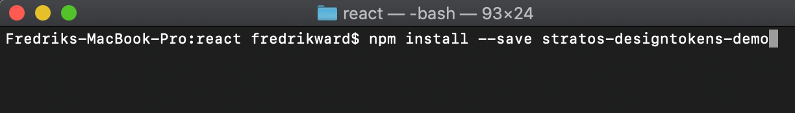

Your design tokens are now available for any codebase on any platform! And **it’s 1:1 with your Design tool’s design document!**

**Feel free to download and test the design tokens example here:**

```text
npm install --save stratos-designtokens-demo
```

### Example usage <a id="dbf2"></a>

#### React

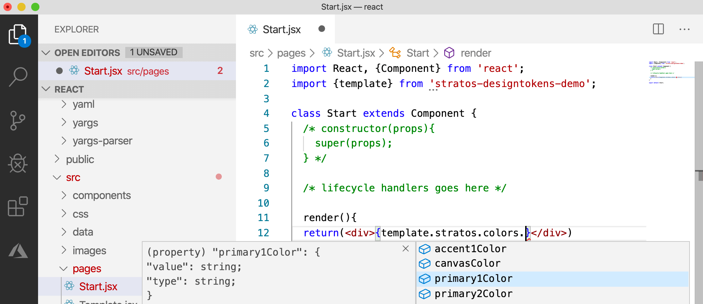

You can of course use this for other frameworks and platforms as well  \(i.e. React native, Vue.js, Angular...\). And with a little help from our built-in Style Dictionary support you can also use your tokens for Android, Swift… ****🤖💪

