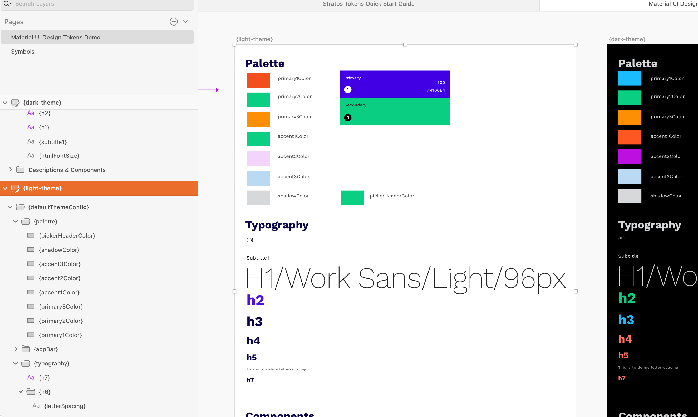
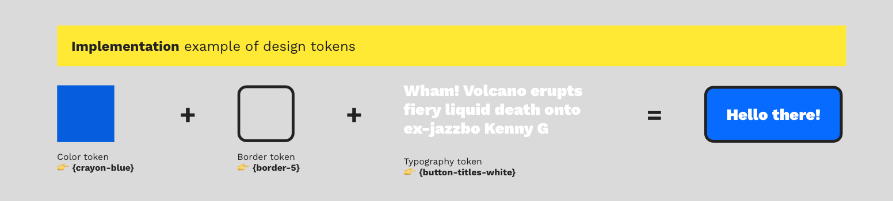

# Migrating from the pre-release 🥏

## What's the breaking change?

**Design token names must now be wrapped in { }** – including **design token artboard names.** That means that all your previous design tokens and design token structure will not work until you:

1. Add **{ }** to all your design token artboards/frames names
2. Add **{ }** to all your design token names on these artboards

The great thing about using **{ } in artboard, layer and groups** names for creating your **design tokens** is that you can **mix them with regular design elements**. Your code is clean, only populated by delicous JSON design token data where you need it to be.

You can use this approach to give examples of use of your design tokens connected to your **design system components**. Great Scott!

## Suggested updating workflow

This workflow is only for all of you awesome people that have bought our pre-release of Stratos Tokens.

1. **Make a copy** of your design document
2. Select all your design tokens, including your artboards and use something like the great [Rename It plugin](https://renameit.design/sketch/) for Sketch and Figma to add { } to each design token
3. Create a **new Stratos Tokens project** in Stratos Tokens 2021
4. Do a happy dance 👯‍♀️

