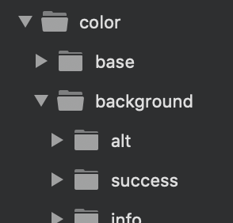
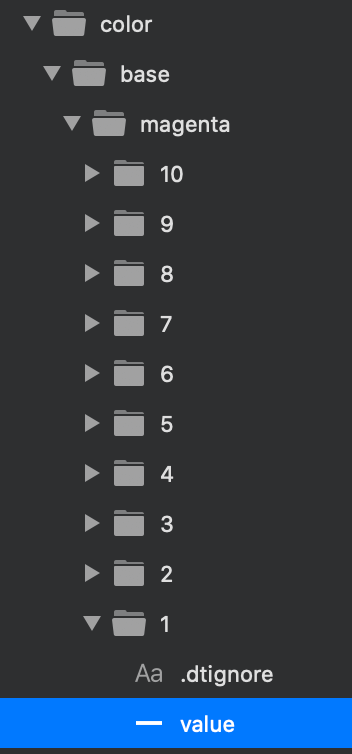
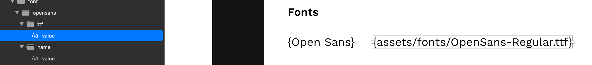
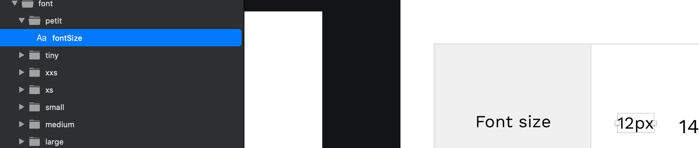

# The basics

## The basic rules

There are **eight design rules** that you **need to follow.**

1. The structure of nested Groups in the design document defines the structure of the output JSON data

1. Rectangles represent a color value based of the rectangle’s fill value

1. Rectangles without a fill results in border formatting.
2. Text layers represent text formatting
3. Text layers with values within _**{ }**_ are evaluated

1. Text nodes with values within **{{ }}** are considered as Style Dictionary references / shortcuts to be able to reuse values. 
2. Text layers with names that matches a CSS property will have only that CSS property’s value \(as opposed to plain Text layers which will contain all CSS properties; see bullet 4 above\)

1. You need to have a frame/artboard named **Start.** It can be empty but it needs to be there for our app to work its magic

