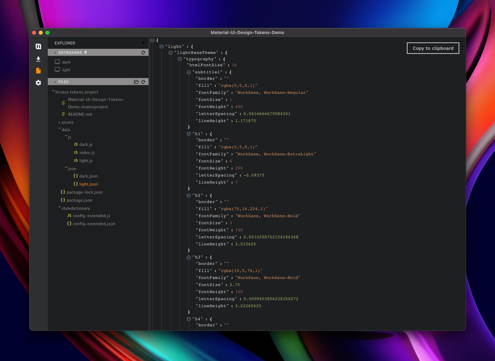
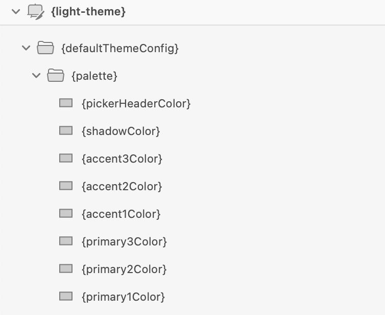
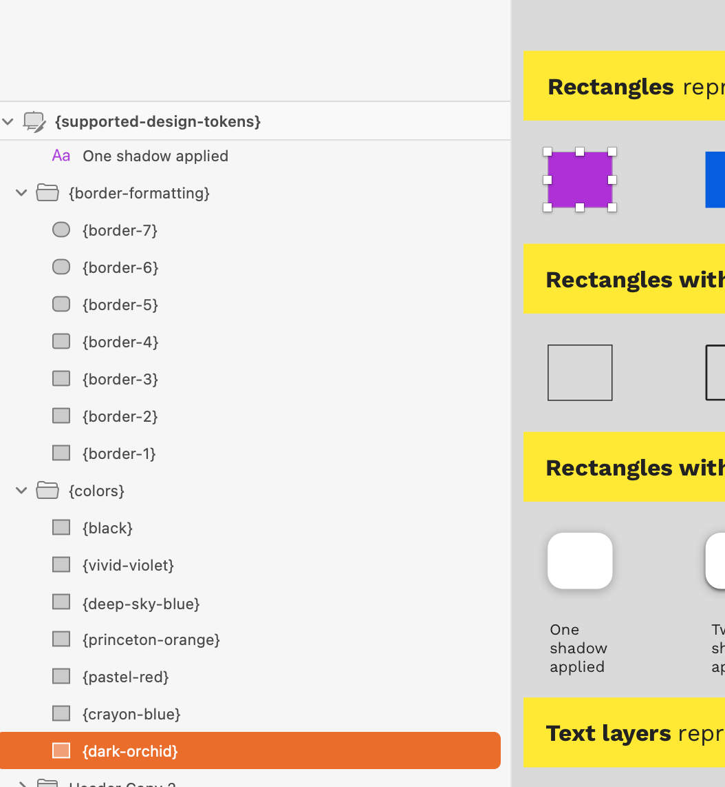
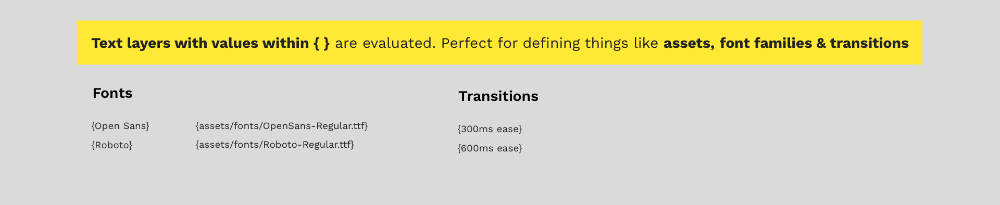
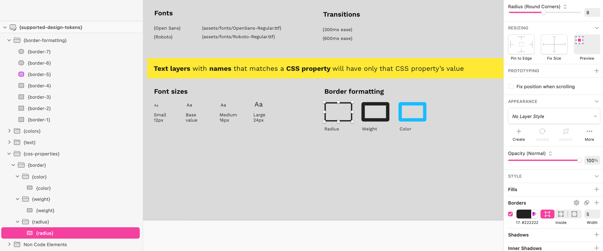
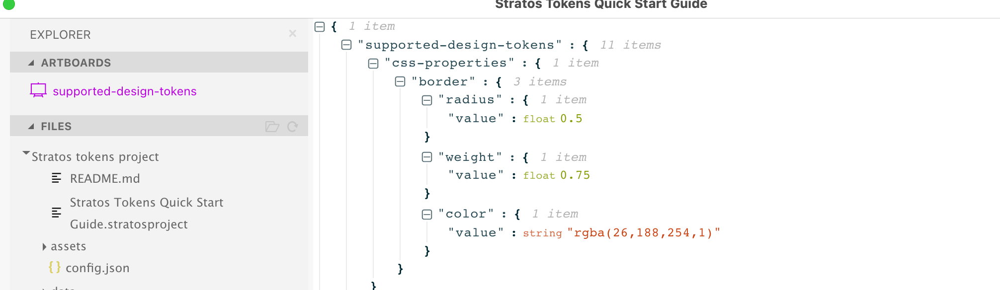

# The basics 🔤

## Introduction

We have a few essential framework rules to get started using our app with Sketch or Figma. **It’s our design tokens 101**. After you grasp our framework, you can start learning how you use **these together with our built-in markup support for** [**Style Dictionary**](https://amzn.github.io/style-dictionary/#/), and you’ll be auto-translating the raw design token data into more formats than you’ll ever need. We promise 😺👍

## The raw output is json

When you apply our **basic framework rules** on layers in Sketch and Figma what you see in our app is the raw design token **json data** 👇 

### **This design data structure is available from three places:**

* Direct copy/paste from each design token artboard that you have created
* Stand-alone file in the project’s _data_ folder.
* Downloadable as _NPM-project_

### Why only raw json design tokens?

The main reason is that many design systems actually use something called **theming** where you can do lots of magical things with "just" exporting json design tokens. [Material-UI](https://material-ui.com/customization/theming/) is one example and we even built a very [simple demo](https://marketplace.sketch2react.io/product/material-ui-demo/) for it.

## What if I need to do more?

That's the whole reason we also have built in support for Style Dictionary.

If you need also to convert the **raw design token json data** into say for example _scss_ you will need to:

1. Use our **framework rules**
2. Use our built-in **Style Dictionary markup** support
3. **Install Style Dictionary** onto your project folder
4. Run the **build command** for Style Dictionary each time you have updated or created new design tokens from Sketch or Figma

_This can seem a bit taunting, we truly understand._ On the other hand, if you follow all these rules plus use Style Dictionary’s markup you will translate the raw design token data into all these formats by default with one build command:

* scss
* less
* android
* iOS
* iOS-swift
* css
* js
* json
* react-native
* sketch-palette

The cool thing with Style Dictionary is that you can add even more so-called [Transforms](https://amzn.github.io/style-dictionary/#/transforms) to better fit your current workflow.

## Stratos Tokens framework rules

* The structure of **nested Groups** in the design document defines the structure of the output JSON data

* Rectangles represent a color value based on the rectangle’s fill value

* Rectangles without a fill results in border formatting. \(you get color, radius, and weight\). Pro-tip: Name your rectangle {\_color}_, {\_radius}_ or {\_weight}\_ to get **only** that value.
* Text layers represent text formatting
* Text layers with values within _**{ }**_ are evaluated👇

* Text nodes with values within are considered as Style Dictionary references / shortcuts to be able to reuse values. These are also known as **alias tokens**.

* Text layers with names that matches a **CSS property** will have only that CSS property’s value \(as opposed to plain text layers, which will contain all CSS properties; see bullet 4 above\). Kindly note that the layer names need to be camel case \(i.e., {fontSize} or {fontFamily}\)

## Style Dictionary markup

We strongly recommend you reading our articles about how to get started with Style Dictionary and Stratos Tokens. They are based on our experience and are fitted for beginners with a designers' perspective.





When you feel comfortable, you can jump ahead and dive deep into Style Dictionary’s own [website](https://amzn.github.io/style-dictionary/#/). It’s not the easiest thing to grasp, specially if you have no code experience. That's one of the strongest reasons we actually built Stratos Tokens, we felt there is a gap here we can fill.

No worries, we’ll keep writing easy-to-follow articles on all of these topics for a very long time. Keep tuned.

