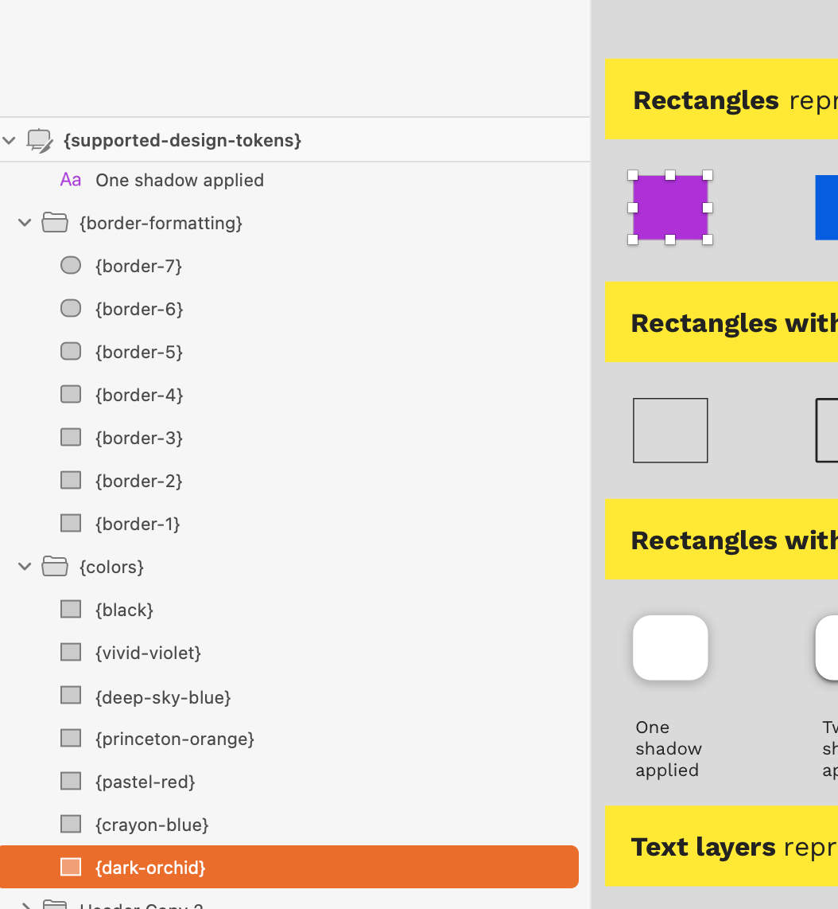

# The basics


We now have a splendin [Sketch assistant](https://www.sketch.com/extensions/assistants/stratos-tokens-assistant/) for the most important rules


## The basic rules

There are **a couple of great rules** that you need to follow.

* The structure of nested Groups in the design document defines the structure of the output JSON data

* Rectangles represent a color value based of the rectangle’s fill value

* Rectangles without a fill results in border formatting.
* Text layers represent text formatting
* Text layers with values within _**{ }**_ are evaluated

* Text nodes with values within **{{ }}** are considered as Style Dictionary references / shortcuts to be able to reuse values. 

* Text layers with names that matches a **CSS property** will have only that CSS property’s value \(as opposed to plain Text layers which will contain all CSS properties; see bullet 4 above\)

