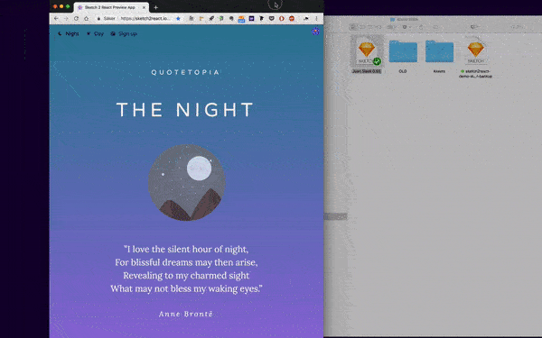

# FAQ 🤓

## What is Sketch2React?

Sketch2React is a **free design to code framework** that consists of:

* A free framework based on **Bootstrap 4** that consists of [**Components**](https://sketch2react.gitbook.io/sketch2react-io/develop/components)\*\*\*\*
* A [**Desktop App**](https://sketch2react.gitbook.io/sketch2react-io/develop/code-app) ****\(Mac only\) that converts your Sketch files into actual code
* A **Sketch plugin** that helps you setting up the Bootstrap Grid inside of Sketch

## When use our framework?

Our framework is really great for many things like for example:

* Static websites like for example portfolios, landing pages, product pages
* Advanced prototypes that you need to be real code

## When should I not use your framework?

All things that require complex logic that we don't yet support. On the other hand, designers can set up things like the grid, colors, fonts, general layout rules and with that developers can do anything. Sky is the limit!

## Do I upload my .sketchfile somehow to your web app?

Nope! Everything is handled locally on your computer, nothing gets uploaded to our servers. Super safe. We promise.

## What is the .sketchplugin for?

You actually don’t need the plugin but it will make your workflow so much faster. It works a bit like a wizard that helps you with all of the really tedious stuff like creating containers, choosing margin and paddings etc. All of these settings can be changed afterwards in Sketchs layer panel.

## Can I use web fonts like Google Fonts?

Yes you can! Actually it’s really easy, check out our handy [Cheat Sheet](https://sketch2react.gitbook.io/sketch2react-io/~/edit/drafts/-LLAM2hl82xAVmvUkC0F/faq) for further instructions.

## How do I export to HMTL?

You use our [Previewer App](https://sketch2react.io/sketch2reactpreviewer/) for that. 

1. First drag your .sketchfile to our Previewer App
2. Make sure you have setup everything accordingly to our framework inside of Sketch
3. Click on the little animated Sketch2React logo up in the left corner
4. Choose "Download HTML version"
5. Save it to your HD or directly to your server
6. Do this for each artboard that you have in your prototype

## Does it cost money?

During our private alpha, no. Everything you create with it will forever be free. What happens after the alpha we currently don’t know. We're fiddling with the thought that everything will be free up until you \(in a future release\) will be able to export directly to React. So basically you can learn the tool, use it for free, even export to HTML but when you want sexy React thingies you will have to pay. It's actually the only way we can insure that this has a long and bright future, no one can survive on free company coffee. ☕️ 

## How stable is the Beta?

**It's really stable.** We call it Beta because we have not reached our goal yet. Not because it's flawed or super buggy. You can read an [article here](http://bit.ly/2y0iMBt) if you’re interested.

