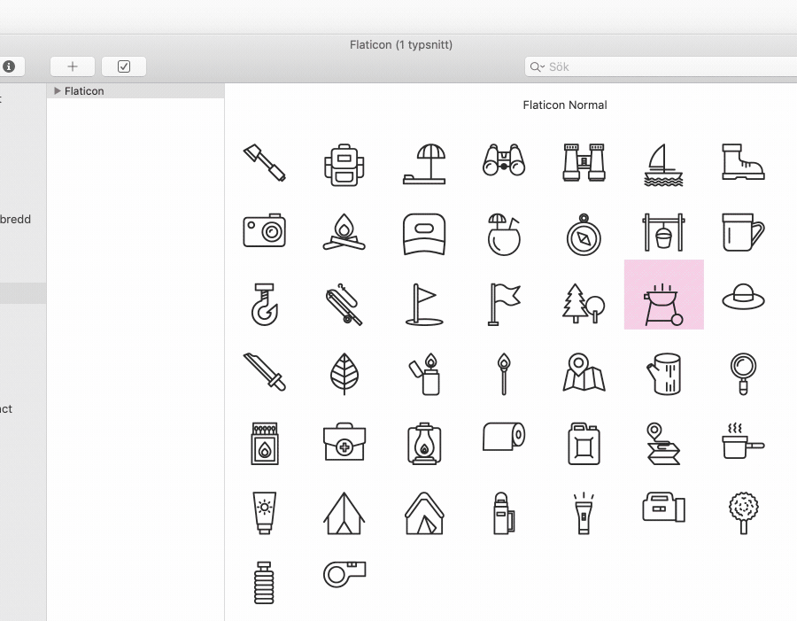
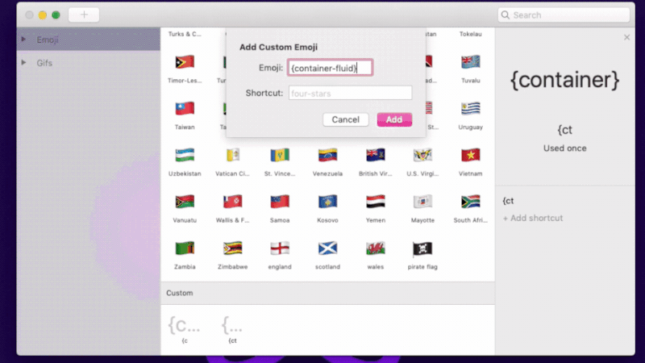
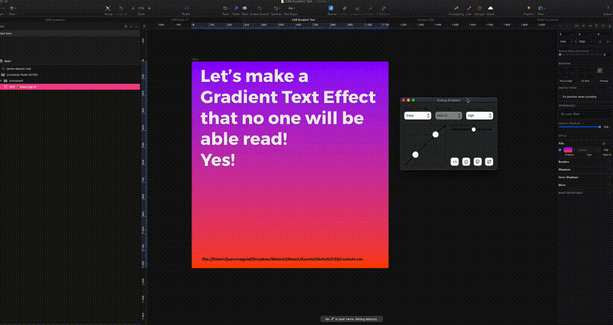
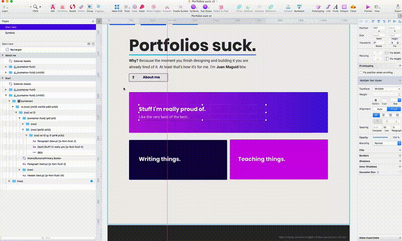
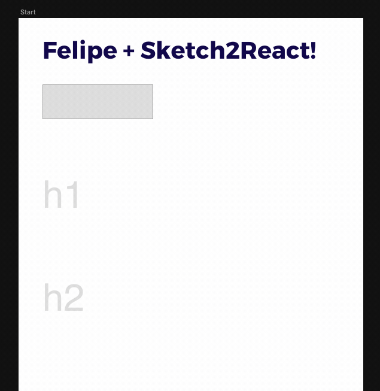
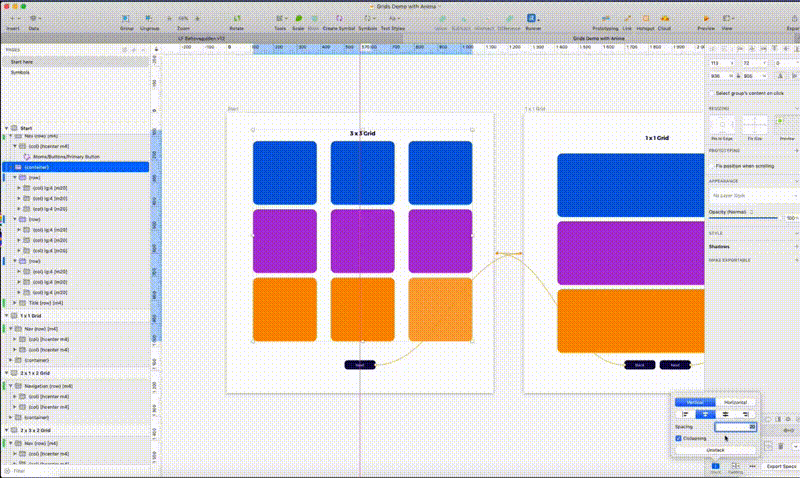
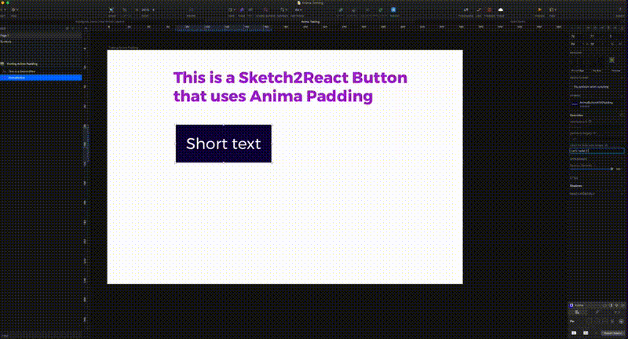
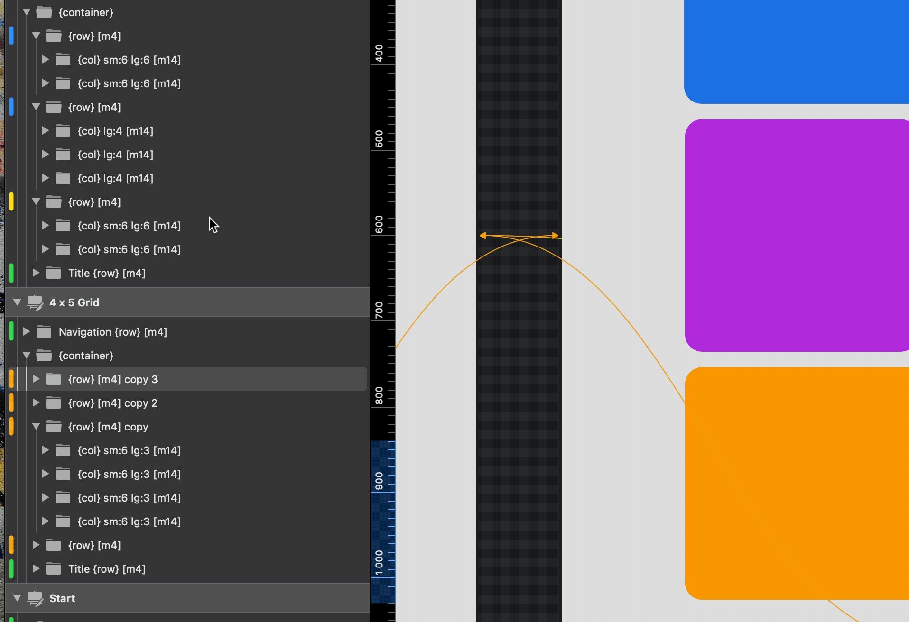
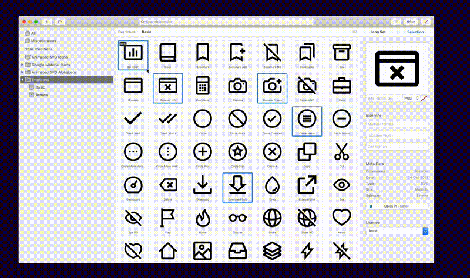

# 3rd Party Plugins & Apps ⚙️

## [Lunacy 8](https://icons8.com/lunacy)

Although Sketch2React was built for Sketch it actually also works well together with Icon8's free design software. How neat is that!? :robot::heart\_decoration:



## [DropPages](https://droppages.com)

[DropPages](https://droppages.com) is an awesome way to really quickly publish and host your Sketch2React exported HTML pages 100% for free to your own Dropbox. Here's a [demo](https://s2rdemo.droppages.com/index.html), and here's a [tutorial](https://sketch2react.io/blog/tutorial-how-to-publish-host-your-website-on-dropbox/) on how to get this working.

## [Flaticon](https://www.flaticon.com)

[Flaticon](https://www.flaticon.com) is a great service of top notch high quality icons that work for many occasions. We use them for all of our branding imagery actually 😄👍They have something totally amazeballs - the ability to **create packs and download these as a font icon**. This gives you an amazing advantage of collecting all of your most used icons inside a font that you can share amongst your team mates.

## [Rocket](https://matthewpalmer.net/rocket/)

Using emoji Mac app [Rocket](https://matthewpalmer.net/rocket/) you can actually add something similar to the **autocomplete** function you have in all major code editors today. Here's how 👍


How to add autocomplete to Sketch2React


## [Sitecake CMS](https://sitecake.com)

.gif>)

[Sitecake](https://sitecake.com) is a brilliantly simple CMS that's actually really [easy to setup ](https://twitter.com/Sketch2R/status/1095970041936429056)to work with the exported HTML5 from our framework. A proper tutorial will come someday!

## [Easing Gradient](https://github.com/larsenwork/sketch-easing-gradient)

Everybody loves gradients (or they should) and this [little gem](https://github.com/larsenwork/sketch-easing-gradient) comes packed with some editing powers that puts Superman to shame. Our favorite is the **Step editor** (seen above). \


Just remember to take away the **autogenerated text** that the plugin adds to your layer name. Rename {BG} or {rectangle} or {oval} and you’re done! 💥 📕


## [Automate Sketch](http://ashung.github.io/Automate-Sketch/)

For our framework to do its black magic, **layers and groups** inside the **layer list** in Sketch need to be in the reverse Y order for them to show up correctly in code.&#x20;

Anyway! [Automate Sketch](http://ashung.github.io/Automate-Sketch/) does that and many many other things. It’s a really quick way of experimenting with things inside of Sketch. Use it together with _Spotlight-For-Sketch_ plugin [Sketch Runner ](https://sketchrunner.com)and you have a killer combo.

## [Felipe](https://www.arielverber.com/felipe/)

[Felipe](https://www.arielverber.com/felipe/) is an intention based plugin for Sketch that will totally blow your mind. Draw a rectangle roughly the shape of a medium sized button, fire away the shortcut for **Wireframes to UI (⌥⌘K)** and like magic it auto-replaces your rectangle with the symbol that you associated it with. It works super well with our framework and it will speed up your design to code process so many times we don't even have a number for it. 😆&#x20;

> It's like working with Framer but in Sketch. 💪 💠


Here's a[ demo Sketch project](https://www.dropbox.com/sh/wnxnfk3ismaymad/AAC0CFbYueHuJTynqAf0baGxa?dl=0) where we have our components working with Felipe


## [Anima App](https://www.animaapp.com)

[Anima](https://www.animaapp.com) is a set of totally awesome plugins for Sketch that takes care of really tedious things such as making sure you have same padding and margins everywhere. Best thing, it works really well with our framework. The new feature **Group Padding** works great with our buttons and Stacks is perfect for keeping things neat inside of Sketch. Here's a [simple tutorial](https://medium.com/sketch2react/how-to-use-animas-group-padding-with-our-bootstrap-buttons-ee53fe81faf1).


Download [this button](https://www.dropbox.com/s/ip005iknbvxyzy3/Anima%20Testing.sketch?dl=0) to see how this needs to be setup.&#x20;



**Important!** Using Anima does not take care of the actual settings in code, you still need to set everything up accordingly to our framework requirements. But it saves tons of time inside of Sketch, giving you a faster workflow.


## [Rename it](https://github.com/rodi01/renameit)

Naming layers correctly is a huge part of making sure our framework outputs code at all. Use [Rename it](https://github.com/rodi01/renameit) **** to batch rename things like text nodes into {text} components.

## [Notes](https://github.com/cshdllr/notes)​

We use [Notes](https://github.com/cshdllr/notes) for pasting in code snippets, url:s to external assets like Google fonts or just copy+pasting a useful {col} setting you want to reuse elsewhere. We love the old school Post-it© look and the plugin comes with a couple of different neat color styles. Notes is useful for ... hmm .. notes 😅

## [Midnight](https://midnightsketch.com)​

The [Midnight plugin](https://midnightsketch.com) for Sketch is one of our favourite ones, specially since you can color code layers and groups. Plus you get amazing **Indent Guides system** which makes it easy to identify how Groups and Layers are nested. Mind blown.&#x20;

## [IconJar](https://geticonjar.com)

Use **IconJar** for all of those custom made icons that you don't have as a icon font.

