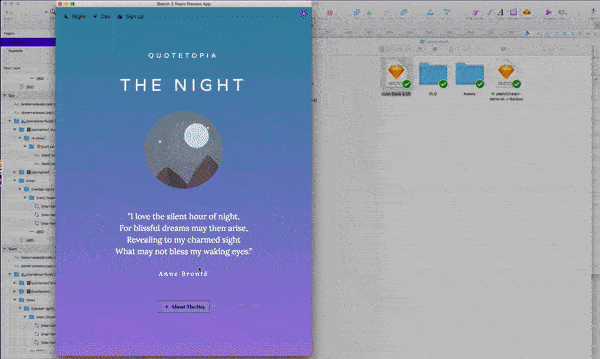

# Sketch2React Markup Cheat Sheet 📓

We use our own markup based on **Atomic CSS, **to tell Sketch what it needs to tell the React app of how things are positioned. Here’s a few guidelines on how to write code inside of your .sketch file. And a few nifty shortcuts!


Use our brand new 🤖👍[Sketch assistant](https://www.sketch.com/extensions/assistants/@sketch2react/sketch2react-assistant/), a helping hand for remembering all those important framework rules 🙌


## Pages & Artboards


The **page** (in Sketch) where you have your designs that you want to render in our app must be named _**Start here**_. The **first artboard** you want to render needs to be named _**Start**_ or else it will not work. Please study our demo files when in confusion, they will teach you a lot.


## Images


**As of version 1.5 we now support SVG’s!** Finally you will not need to export assets in and out again for them to show up in code 🥳


### How to export to SVG

1. Group your vectors, make sure not to use special characters
2. **Make exportable** and select SVG from the dropdown in Sketch
3. Voila! Your SVG asset should now be visible in our code app
4. If you make changes to your vectors you will need to re-link the .sketch file to our code app for them to show up in code

#### We still also support

* {image} = responsive 100%
* {image-fixed} = fixed size according to what you have set up in Sketch


🎓⭐️**ProTip:** Use _**icon fonts**_ for your icons, that way you can embed the icon library as a {externalasset.css} so no need to export them one by one, and re-import them.


### Example


> {image-fixed} \[mb10] - beard dude icon@2x

This means that the beard dude has a fixed image size and a margin bottom of 10 pixels. Also as you see in the given example you can add whatever text you want after the \[...] - sweeeeet 🍩🍦


**ProTip!** Make sure to export/reimport your assets at the **@2x resolution** so that you don't get fuzzy edges on retina resolution screens. You can use the very handy **Make Exportable** function in Sketch app and just drag/drop the bitmap back to your artboard once you have enabled it.


## Fonts & Icons

We support **linking web fonts** directly from inside of Sketch! In our demos we use Google fonts but it should work exactly like this for other type platforms that uses similar methods.

We also support popular **icon fonts** such as Ion Icons, Material Icons, Fontawesome. You can even create your own icon set with services like [Fontastic](http://fontastic.me/howto).

🎓⭐️**ProTip:** Use this awesome Sketch plugin called [Icon Font](https://github.com/keremciu/sketch-iconfont) for installing icon bundles.

#### Example  <a href="example" id="example"></a>


In Sketch use the **Text tool** (⌘+T) and write this in the layers panel:

```
{externalasset.css} Whatever You Want Goes In Here
```

Inside the text node **copy/paste the correct url** that you’re given by your font provider for the font you use in your document. In this case we use both Varela Round and Lora in our mobile demo so it becomes [https://fonts.googleapis.com/css?family=Lora|Varela+Round](https://fonts.googleapis.com/css?family=Lora|Varela+Round).

**Copy this exact text layer to each artboard** that you generate where you want the fonts to render correctly when exporting to .html files. You can turn down the opacity of the text layer to 0% it will still work. 😋 👍

The whole purpose of doing this inside of Sketch is that you will be able to share your design prototypes with other people by uploading them to your own servers.

## Fluid fonts




**Pro tip!** By adding the class _js-font-fluid-12_ you will have fluid font-size. The last part (12) refers to the number of px the font will span between. This is also dependant of the artboart size.


#### Example:

* You have a mobile-size artboard (576px wide).
* You have a {text} with font-size 18px.
* You have a {text} with the class _js-font-fluid-10_ ( {text} \[js-font-fluid-10])

The font-size will then flow between 18px at the smallest screen-size and 28px at the largest screen-size.

**Another example:**

* You have a desktop-size artboard (>576px wide).
* You have a {text} with font-size 18px.
* You have a {text} with the class _js-font-fluid-12_ ( {text} \[js-font-fluid-12])

The font-size will then flow between 6px at the smallest screen-size and 18px at the largest screen-size.

**Supports:**

> * classes \[ ]

**Since:** v0.0.5

**Updates:** v0.0.55 - Fluid font support

## Margins

* m1 - m150 = margin 1px-150px
* mt = margin top
* ml = margin left
* mb = margin bottom
* mr = margin right

#### Example  <a href="example" id="example"></a>

> mr78 = margin right 78px
>
> mr78percent = margin right 78%

## Paddings

* p1 - p150 = padding 1px - 150px
* pt = padding top
* pl = padding left
* pb = padding bottom
* pr = padding right

#### Example  <a href="example" id="example"></a>

> pr78 = padding right 78px
>
> pr78percent = padding right 78%

## Alignment

* hcenter = center content

## Columns

Every Row contains Columns based on a 12 column grid.

> {col}

## Rows

Every Container contains rows

> {row}

## Breakpoints

In order to tell the Bootstrap-grid how to behave at different screen sizes (width in px) you have breakpoints. You specify how the columns should group at different breakpoints by using the prefixes: _xs, sm, md, lg, xl._

_**From Bootstrap documentation:**_

> sm: Small devices (landscape phones, 576px and up)
>
> md: Medium devices (tablets, 768px and up)
>
> lg: Large devices (desktops, 992px and up)
>
> xl: Extra large devices (large desktops, 1200px and up)

Extra small devices (portrait phones, less than 576px) No need for a media query since this is the default in Bootstrap.

Non the less we do support xs-break point:

> xs: Extra small devices (portrait phones, less than 576px)

#### Example  <a href="example" id="example"></a>

> {col} sm:12 lg:6 - A Column covers 12 columns at the sm-breakpoint (576px+) and 6 columns at the lg-breakpoint (992px+)

## Classes

css-classes on elements are written within \[ ]. See chapter ”Paddings”, ”Margins” and ”Alignment”.

#### Example  <a href="example" id="example"></a>

> {col} \[m20]

or with multiple css-classes

> {col} \[m20 pt10 hcenter]

## Responsive Classes

Our Atomic CSS also includes responsive margin- and padding classes. This mean that you can have different margins and paddings for different screen sizes.

You can utilize these by using the prefix ”mq” like this:

```
mq-[breakpoint size]-[padding or margin]
```

### Example

> mq-lg-mb25

This will give you a margin-bottom of 25px at large screen size width and above (see section about Bootstrap’s breakpoints).

### Another example

```
mb10 mq-md-mb40 mq-lg-mb60
```

This will give you a a margin-bottom of 10px up until medium size screens and then switch to 40px up until large screen size where padding-bottom once again changes. This time to 60px. (see section about Bootstrap’s break-points).

## Shortcuts

* {curly brackets} = **alt + shift + ( )**
* \[brackets] = **alt + ( )**
