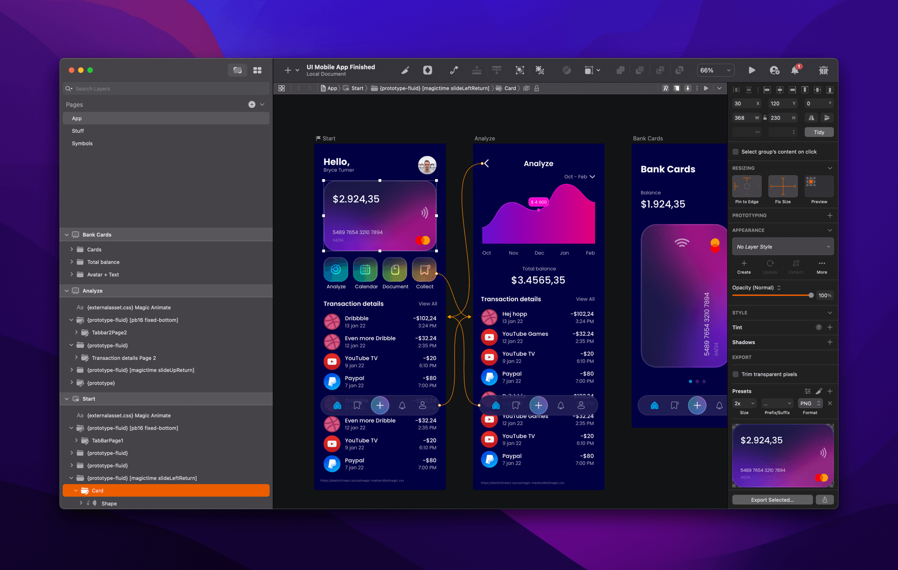
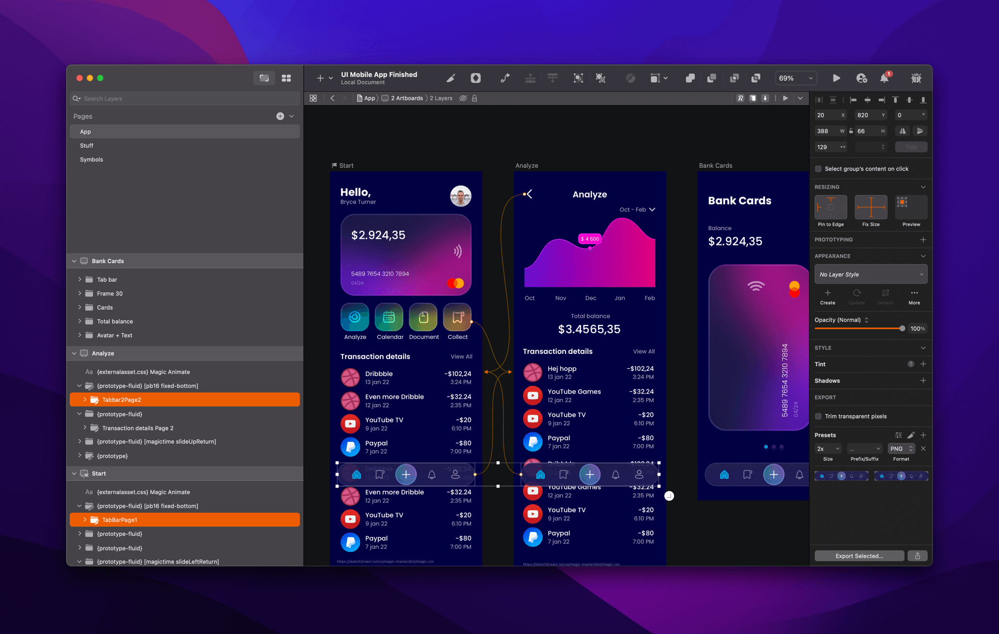
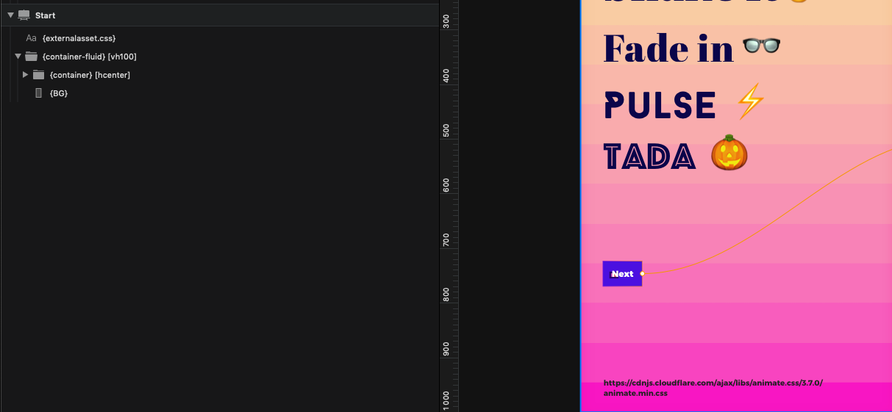

# Components 💎

## Rapid Prototyping Components

When you don't have the time needed to build actual real code components we strongly recommend starting with these. They can be combined with all of our other components, making them very powerful.



### {prototype}

This component outputs an absolute positioned html element based on the x- and y-coordinates of the {prototype} Sketch layer/group relative to the artboard. The html element also has a fixed size based on the size of the Sketch group's frame.

This components supports Sketch and Icons8 Lunacy Prototyping with hotspots and "fixed position when scrolling".

#### Code output:

A \<div> element. If Sketch prototype hotspot has been added to the {prototype} layer in Sketch the \<div> is wrapped by an anchor tag (\<a>) E.g: \<a>\<div>\[CONTENT OF PROTOTYPE SKETCH GROUP]\</div>\</a>

#### **Supports:**

> * classes \[ ]
> * Sketch prototype with Hotspots (incl. "fixed position when scrolling")

**Since:** v2022.0.1


ProTiP!🤖💪Make sure to add your PNG's in the @2x resolution for crispier high resolution prototypes


#### Use unique names




E.g you have a tab bar on Artboard 1 and a copy of it on Artboard 2. When adding your tab bar to export, via Make Exportable, make sure you give them unique names, or they will overwrite each other.&#x20;


### {prototype-fluid}

Like {prototype} but it fills the entire width of its parent element.

Note: It takes into account the x-offset (distance from the left edge of the artboard to the left edge of the {prototype-fluid} layer/group's frame) and deducts an equal amount of spacing on the opposite side to make it look centered.

#### Code output:

A \<div> element. If Sketch prototype hotspot has been added to the {prototype} layer in Sketch the \<div> is wrapped by an anchor tag (\<a>) E.g: \<a>\<div>\[CONTENT OF PROTOTYPE SKETCH GROUP]\</div>\</a>

#### **Supports:**

> * classes \[ ]
> * Sketch prototype with Hotspots (incl. "fixed position when scrolling")

**Since:** v2022.0.1

### {embed}

The {embed} component let you embed third-party content such as Google maps, other websites, Lottie animations or Spline3d directly into your apps.

You need to define the {embed} component's source as show in this screenshot:


**Please note:** You do not need to have a placeholder, it's just to make your design look nice :)&#x20;

#### Code output:

An \<iframe> element.

#### **Supports:**

> * classes \[ ]

**Since:** v2022.0.5

### {embed-fluid}

Like {embed} but it fills the entire width of its parent element.

.png>)

#### Code output:

An \<iframe> element.

#### **Supports:**

> * classes \[ ]

**Since:** v2022.0.5

## **Grid & Layout Components**

These are for setting up grids and layouts in Sketch. You create all of them in Sketch **by creating Groups (⌘G) and renaming the groups accordingly.**

### **{container}**


```
{container}
```

Creates a Bootstrap **Container** element. This is the outermost element in a Bootstrap grid.&#x20;


**Note:** You can also have {container} elements inside of {col} elements (known as nesting).


**Supports:**

> * classes \[ ]
> * Backgrounds {BG}

**Since:** v2022.0.1


#### How to add in Sketch:

1. Create a text node **(T)**
2. Group that text node **(⌘+G)**
3. Rename group **{container}**
4. Delete text node _or_ name it {text}&#x20;


### **{container-fluid}**


```
{container-fluid}
```

Creates a Bootstrap **Container-fluid** element. This element (as opposed to {container}) always covers 100% of the available width (screensize or, if nested, the width of the parent {col} element)

#### **Supports:**

> * classes \[ ]
> * Backgrounds {BG}

**Since:** v2022.0.1


#### How to add in Sketch:

1. Create a text node **(T)**
2. Group that text node **(⌘+G)**
3. Rename group **{container-fluid}**
4. Delete text node _or_ name it {text}&#x20;


### **{row}**

```
{row}
```

Creates a Bootstrap **Row** element. A {row} is a direct child to {container} or {container-fluid}. This element's height is always at least as high as the corresponding element in the Sketch document.

#### **Supports:**

> * classes \[ ]
> * Backgrounds {BG}


#### **Pro tip!**&#x20;

By adding the Bootstrap 4 class _no-gutters_ you will remove gutters from child {col}.&#x20;

Example:

#### {row} \[no-gutters]


**Since:** v2022.0.1


#### How to add in Sketch:

1. Create a text node **(T)**
2. Group that text node **(⌘+G)**
3. Rename group **{row}**
4. Delete text node _or_ name it {text}&#x20;


### **{col}**

```
{col}
```

Creates a Bootstrap **Column** element. A {col} is a direct child to {row}. {col} can contain {container} or {container-fluid} elements (Known as nesting). It is within this element you place all your content.

**Supports:**

> * classes \[ ]
> * Backgrounds {BG}

**Since:** v2022.0.1


#### How to add in Sketch:

1. Create a text node **(T)**
2. Group that text node **(⌘+G)**
3. Rename group **{col}**
4. Delete text node _or_ name it {text}&#x20;


### **{group}**

`{group}`&#x20;

This is a **structural component** used as a helper to align it’s child-elements (vertically or horizontally). It supports classes, but not Sketch-styling.

#### Horizontally:

If you, within a {group} place X number of Sketch2React elements next to each other horizontally, {group} will make sure they end up horizontally in code. They will also be automatically centered vertically.

The remaining space (the difference/delta between the child-elements total width and the {group}’s own width) will be distributed evenly **between** the children.

#### Vertically:

If you, within a {group} place X number of Sketch2React elements stacked vertically in Sketch, {group} will make sure they end up vertically in code.&#x20;

The remaining space (the difference/delta between the child-elements total height and the {group}’s own height) will be distributed evenly **between** the children.&#x20;

**Supports:**

> * classes \[ ]

**Since:** v2022.0.1

### {group-fixed}

`{group-fixed}`

This element is identical to {group} except that it always keeps the same width (taken from Sketch) even when you resize it’s parent component (e.g. a {col}).&#x20;


**Note!** {group-fixed} is never wider that the size of it's parent element.&#x20;


**Supports:**

> * classes \[ ]

**Since:** v2022.0.1

### {div}

A generic component well suited for implementing things such as other grid systems (e.g. [MaterialUI grid](https://www.muicss.com/)) or construct your own components!

**Since:** v2022.0.1

## Basic Components

These are for common design tasks such as texts, images & backgrounds. You create all of them in Sketch **by using the Shape Tools. Images you import.**

### **{text}**

```
{text}
```

The text-layers created in Sketch needs to be named {text} in order for the code app to find them and parse them properly. By default {text} generates an HTML paragraph tag.

You can set which kind of HTML element should be created by specifying e.g. _{text.span}_. Available types are:

**{text.p}** (same as default {text}) - This creates an HTML paragraph tag

```
{text.p}
```

**{text.span}** - This creates an HTML span tag

```
{text.span}
```

**Supports:** Text styles

### **{image}**

```
{image}
```

Creates an image with a responsive size. It scales according to available width.

**Supports:**

> * classes \[ ]

**Since:** v2022.0.1


**ProTip!** Make sure to export/reimport your assets at the @2x resolution so that you don't get fuzzy edges on retina resolution screens.


### **{image-fixed}**

```
{image-fixed}
```

Creates an image with fixed width and height (taken from Sketch).

**Supports:**

> * classes \[ ]

**Since:** v2022.1.0

### {image-external}


```
{image-external}
```

Host images, GIFs and even animated SVGs externally. Download this [.sketchfile](https://www.sketch.com/s/a6a495c7-7a18-4b9f-8b67-f6fa83ce49c3) and grab the component.

**Supports:**

* classes \[ ]

**Since:** v2022.0.7

### {rectangle}

```
{rectangle}
```

Creates a HTML-div element that is 100% of it's parent elements height and 100% width of it's parent element. This element's height is always at least as high as the corresponding element in the Sketch document.


By adding the Bootstrap class \[rounded-circle] to the {rectangle} you'll get a rounded circle.


```
{rectangle} [rounded-circle]
```

This is a Sketch "Rectangle"-Shape


**Pro tip!** This is an awesome way to create responsive wireframes 🎉


**Supports:**

> * classes \[ ]

**Since:** v2022.0.1

### **{BG}**

```
{BG}
```

Can be a rectangle or an image.&#x20;


**Pro tip!** Fill the {BG} with a nice linear gradient for really nice website backgrounds that are super lightweight in size. Use {container-fluid} and put the {BG} like below:




**Since:** v2022.0.1

**Supports:** Layer styles

### {oval}

```
{oval}
```

Using the **O** inside of Sketch you can create an oval element.

**Supports:**

> * classes \[ ]

**Since:** v2022.0.1

## **Interactive Components**

These are all of our interactive components like buttons, navigation, forms. These are a bit more complex but still use only native Sketch tools. **Please refer to our many demo files and study our interactive components.**

### **{button-primary} (Symbol)**

```
{button-primary}
```

Creates a Bootstrap primary button element. You need to use the symbol _Primary-button_ from the Sketch demo-document!

**Supports:**

> * classes \[ ]
> * Backgrounds {BG}

**Since:** v2022.0.1

### **{button-secondary} (Symbol)**

```
{button-secondary} 
```

Creates a Bootstrap secondary button element. You need to use the symbol _Secondary-button_ from the Sketch demo-document!

**Supports:**

> * classes \[ ]
> * Backgrounds {BG}

**Since:** v2022.0.1

### {button-submit} (Symbol)

```
{button-submit} 
```

Creates a Bootstrap-style submit button. This is used for {form}.

**Supports:**

> * classes \[ ]
> * Backgrounds {BG}

**Since:** v2022.0.1

### **Form (Symbol)**

Creates an HTML-form. Use the Form-symbol from the demo-document as reference.

**Since:** v2022.0.1

### **{form}**

Use the Form-symbol from the demo-document as reference.

**contains:** {button-submit}, {form-group}, {attribute.action}, {attribute.method}

```
{form}
```

**Since:** v2022.0.1

### **{form-group}**

Use the Form-symbol from the demo-document as reference.

**contains:** {text}, {input}

```
{form-group}
```

**Since:** v2022.0.1

### **{input} (Symbol)**

Creates an HTML text-input field.

**Supports:**

> * classes \[ ]
> * Backgrounds {BG}

**Since:** v2022.0.1

### **{navbar-light}**

```
{navbar-light}
```

Creates a Bootstrap Navbar element.&#x20;

**contains:** {nav}

**Supports:**

> * classes \[ ]
> * Backgrounds {BG}
> * Breakpoints (xs, sm, md, lg, xl) See cheetsheet for details.

**Since:** v2022.0.1

**Updates:** Now possible to style

### **{navbar-dark}**

```
{navbar-dark}
```

Creates a Bootstrap Navbar element.

**contains:** {nav}

**Supports:**

> * classes \[ ]
> * Backgrounds {BG}
> * Breakpoints (xs, sm, md, lg, xl) See cheetsheet for details.

**Since:** v2022.0.1

**Updates:** Now possible to style

### **{nav}**

```
{nav}
```

Creates a Bootstrap Nav element. Contains one or more {nav-item} and {nav-item-active} elements.

**contains:** {nav-item}, {nav-item-active}

**Supports:**

> * classes \[ ]
> * Backgrounds {BG}

**Since:** v2022.0.1

**Updates:** Now possible to style

### **{nav-item} (Symbol)**

```
{nav-item}
```

Creates a navigation-link (HTML \[a] tag). You need to use the symbol _nav-item_ from the Sketch demo-document!

**Since:** v2022.0.1

**Updates:** Now possible to style

### **{nav-item-active} (Symbol)**

```
{nav-item-active}
```

Creates an active-style navigation-link (HTML \[a] tag). You need to use the symbol _nav-item-active_ from the Sketch demo-document!

**Since:** v2022.0.1

**Updates:** Now possible to style

### {link} (Symbol)

```
{link}
```

Link component that give you the ability to link anything to anywhere.

**Since:** v2022.0.1


## Other

Here's those that are hard to categorize 😸🌵

### **{externalasset.css}**

```
{externalasset.css}
```

Links to external assets such as fonts or your own custom style-sheets.


#### How to add in Sketch:

1. Create a text node **(T)**
2. Rename text node in the Layer List to **{externalasset.css}**
3. In the text node itself, enter the url to the external asset
4. Copy+paste this to each page that uses the external assets&#x20;


**When in doubt, use the demo document as a reference :)**

**Since:** v2022.0.1

### **{externalasset.js}** <a href="#5084" id="5084"></a>

It is now possible to add your own javascript-files to your HTML-exports. This adds a new dimension of interactivity to your HTML-exports!

**Since:** v2022.0.1

### Fluid fonts


**Pro tip!** By adding the class _js-font-fluid-12_ you will have fluid font-size. The last part (12) refers to the number of px the font will span between. This is also dependent of the artboard size.


#### First example

* You have a mobile-size artboard (576px wide).
* You have a {text} with font-size 18px.
* You have a {text} with the class _js-font-fluid-10_&#x20;

```
{text} [js-font-fluid-10]
```

The font-size will then flow between 18px at the smallest screen-size and 28px at the largest screen-size.

#### **Second example**

* You have a desktop-size artboard (>576px wide).
* You have a {text} with front-size 18px.
* You have a {text} with the class _js-font-fluid-12_

```
{text} [js-font-fluid-12]
```

The font-size will then flow between 6px at the smallest screen-size and 18px at the largest screen-size.

**Supports:**

> * classes \[ ]

**Since:** v2022.0.1

**Updates:** Fluid font support

