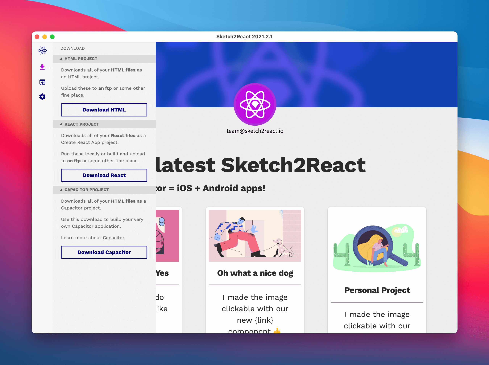

# Exporting to Code 🚚

## Export to Ionic Capacitor (iOS, Android)



You can export directly to iOS & Android project via something awesome called Ionic [Capacitor.js](https://capacitorjs.com)

1. Make sure you have [all links between pages](https://sketch2react.io/blog/tutorial-from-sketch-to-xcode-the-no-code-way/) working and that you have visited each page once (it gets added to our export bundle that way)
2. Click on the Download button 👉 **Download Capacitor project**
3. Unzip the folder we created for you
4. Make sure you compress the images, we 🧡 [TinyPNG](https://tinypng.com)
5. Drag the entire folder onto e.g., Visual Studio Code
6. Open up a New Terminal in VSC
7. Type `npm install` and hit enter
8. Done!

### Install Xcode Command Line Tools & CocoaPods first

This is **crucial** to do before you go to the next step of installing either the iOS or Android platforms.

* Download and install the **Xcode Command Line tools**. You can do this directly from [within Xcode](https://capacitorjs.com/docs/v3/getting-started/environment-setup) or you can just fire up the mighty Terminal app and add this installation snippet:

```
xcode-select —install
```

* Download and install [CocoaPods](https://cocoapods.org), easiest is just by adding this snippet directly in the Terminal:

```
sudo gem install cocoapods
```

### Choose between iOS or Android

Now comes the part where you choose which platform to install for use with Capacitor. You can choose between iOS or Android, we have added both to the config.json file.&#x20;

#### **For iOS**

Just follow [these instructions](https://capacitorjs.com/docs/v3/ios#adding-the-ios-platform).

#### **For Android**

Just follow [these instructions](https://capacitorjs.com/docs/v3/android#adding-the-android-platform).


## Export to HTML


1. First of all, make sure you _visit each and every page_ within our code app that you want to be included in your **Export Bundle.** Wait for the **Your Artboard was added to the export bundle** message to appear, it will take a few seconds per artboard, we're just making sure all the good stuff gets included 😺
2. Go to the **Side Bar** in our app and click **Download**
3. Save to great place
4. You know have a **.zip file** with all of your files, assets neatly organized in separate folders
