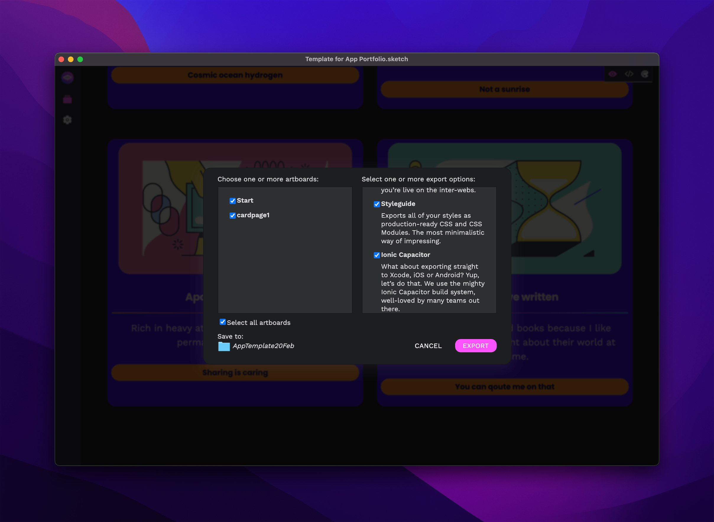

# Exporting to Code 🚚

## Export to Ionic Capacitor (iOS, Android)



You can export directly to iOS & Android project via something awesome called Ionic [Capacitor.js](https://capacitorjs.com)

1. Make sure you have visited each artboard in Marcode’s Explorer once
2. Open up the Export view **⌘E** and choose **Ionic Capacitor**
3. Select a directory for your exported **project folder**
4. Hit the Export button and you’re ready for the next step ✅

### Install Xcode Command Line Tools & CocoaPods first

This is **crucial** to do before you go to the next step of installing either the iOS or Android platforms.

* Download and install the **Xcode Command Line tools**. You can do this directly from [within Xcode](https://capacitorjs.com/docs/v3/getting-started/environment-setup) or you can just fire up the mighty Terminal app and add this installation snippet:

```
xcode-select —install
```

* Download and install [CocoaPods](https://cocoapods.org), easiest is just by adding this snippet directly in the Terminal:

```
sudo gem install cocoapods
```

### Choose between iOS or Android

Now comes the part where you choose which platform to install for use with Capacitor. You can choose between iOS or Android, we have added both to the config.json file.&#x20;

#### **For iOS**

Just follow [these instructions](https://capacitorjs.com/docs/v3/ios#adding-the-ios-platform).

#### **For Android**

Just follow [these instructions](https://capacitorjs.com/docs/v3/android#adding-the-android-platform).

## We have a great guide




## Export to HTML


1. Make sure you have visited each artboard in Marcode’s Explorer once
2. Open up the Export view **⌘E** and choose **Ionic Capacitor**
3. Select a directory for your exported **project folder**
4. Hit the Export button and you’re done ✅
