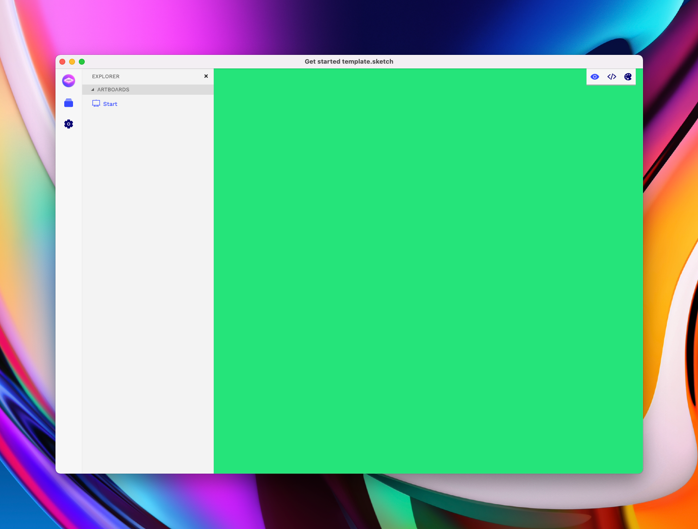

# Get started guide 🍕

## In Sketch or Lunacy

1. Create a **new file ⌘N**
2. Rename the _Page 1_ page 👉 _**App**_

.png>)

1. Create a new Artboard (A) size does not matter
2. Rename it from _Artboard_ 👉 _**Start**_

.png>)

1. Save your Sketch file
2. Open up Marcode app

## In Marcode

.png>)

1. Press on the _**Link a Sketch file**_ area in our app
2. Locate your **newly created Sketch file** from the steps above
3. It should look like this 👇🤖\

.png>)

1. Let's add a background color to our Start Artboard and see what happens
2. Ours looks like this 👇

.png>)

1. Save in Sketch and now look inside Marcode app, should look like this 👇

## What have we learned?

1. How to create a blank Marcode starter template in Sketch
2. How to connect the Sketch file to Marcode app
3. How to add a background color to our first Artboard, that always need to be named _Start_ (never ever take this one away, our app will break). _Start_ is the index.html page.

## What do I do next?

1. Learn our markup, it's super easy
2. Add as many new Artboards as you might need, but always keep **Start** (index.html)
3. Start with our[ {prototype} components](components.md#rapid-prototyping-components), a very fast way of getting 1:1 designs out to iOS, Android and HTML apps
4. Have fun! 😺🧡

#### Download above Sketch file&#x20;


