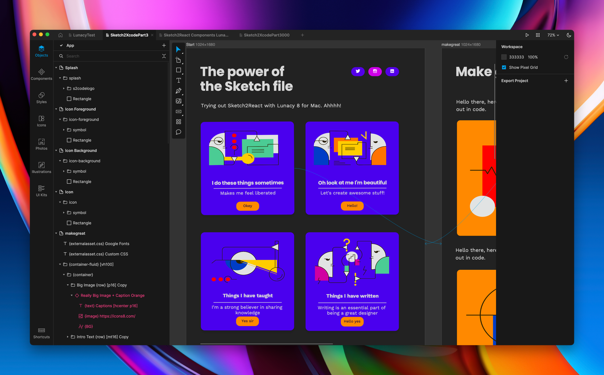

# Using Marcode with Icons8 Lunacy

Just because Icons8 Lunacy reads and writes in the amazing .sketch format it’s a fundamentally different app, it’s not a Sketch clone. **Super important to understand this.**

## Lunacy vs Sketch

.png>)

It’s more like a nice combo of both Sketch and Figma with incredible features for collaboration, using cloud documents etc. It also has things that the other ones haven’t, like a huge free library of icons, illustrations and stock photography. Plus many more things, you should really give it a try.

### What works really well

* All of our freebies that have been created in Sketch that you can download from our [marketplace](https://marketplace.sketch2react.io/product-category/freebies/)
* Layer effects like drop shadows, blending modes, gradients (both linear and now also radial)
* Styling components
* Shared styles like typography, effects
* Styleguide CSS export
* Exporting to HTML, iOS, Android and Xcode

## How Lunacy handles overrides

.png>)

In Marcode we use the **override’s panel in Sketch** to solve the connections and logic we have in all of our interactive components. Since Lunacy does not handle overrides this way, this is a bit of a pickle for us, least to say.

We added automatic HTML links between artboards mostly to solve this with Lunacy. Turns out, it also benefits users of Sketch. Who doesn’t want more automatic workflows in life?

So basically, the easiest way to put this is to say that:

* **Basic logic**, like linking between artboards works thanks to our automatic HTML linking
* Using our {prototype} components works really well
* All other logic works, but can’t be setup from scratch in Lunacy. You can use our demo files to extract all of our components that have logic inside them

If you can live with that, go ahead, try it out. Icons8 Lunacy is 100% free.

.png>)

## **How Lunacy handles SVG's and Make Exportable image assets**

Sketch has something built-in that is called _sketch-tool_. It's what Marcode uses to automagically add everything from SVG's, PNG's etc as soon as you do the **Make Exportable** command inside Sketch app.

The neat thing about _sketch-tool_ is that it speeds up the workflow suggested for using our Rapid Prototype Components {prototype} and {prototype-fluid}…

Since Lunacy is a **cross-platform app**, and not using _sketch-tool_ at all, there is no way for Marcode to automatically add your image assets like we do in Sketch.&#x20;

Here's a simple workaround using our {image} components.

## Workaround

1. **Group** whatever graphical elements that you want to rasterize into an image. It can be a headline, an SVG illustration etc
2. Add the group to **Export**
3. Make sure you use PNG @2x resolution BUT without the prefix or suffix, the image file output needs to be **yourtitle.png** not _yourtitle@2x.png_, or it will not show up in Marcode.
4. Press the Export Selected button, save to your HD
5. **Reimport** the image file and add {image} or {image-fixed} before the layer name 👇

