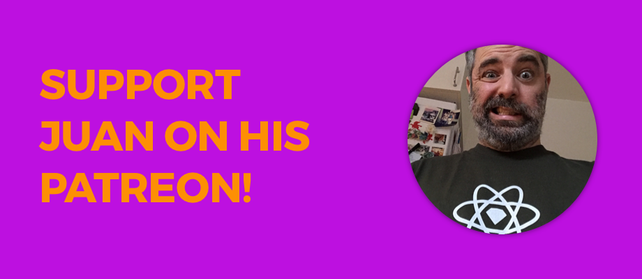

# Pricing 💵

## **Support us by purchasing DLC**

Since our framework is free we are experimenting with different ways of supporting this project financially. A new way of supporting us is to purchase something that we call **Sketch2React DLC.** Basically it's a **super bundle** of all the things locked away on Patreon. [Read more here](https://medium.com/sketch2react/sketch2react-dlc-1-is-here-4e8055568fab) or just purchase [directly here](https://gum.co/dWfpH).

## **How much does it cost?**

**Nothing.** Zero bananas. Zero dollares zero pesetas. We will continue to offer our framework and code app for free as long as we can support it. Speaking of support, **you really should think about supporting us**, we are now on Patreon. Since Patreon is taxable income and we are not a company \(just two dudes doing great stuff together\) we have one for each of us.

[Read more about it here](https://medium.com/sketch2react/support-sketch2react-on-patreon-b76ef1f21356) or just click on our links below…

### [Support Fredrik's work with Sketch2React](https://www.patreon.com/sketch2react)

#### What does Fredrik do?

* **Develops and maintain our magical framework & code app**
* Product development together with Juan
* Backend stuff
* Writes documentation
* Codes new awesome features and **pushes known boundries of design to code** 
* From time to time he even makes tutorials 👍

### [Support Juan's work with Sketch2React](https://www.patreon.com/designforventures)

#### What does Juan do?

* Responsible for **designing stuff**
* Product development together with Fredrik
* **Video tutorials** and written tutorials
* Writes documentation & blog posts 
* Design and development of our main website
* Tweets a lot 😄

## **What’s new in V1?**

* Export to **HTML5, Vanilla React or React**
* **Public Preview** lets you start a temporary web server right from our app
* Pages now add themselves automagically to our export bundle after loading/visiting them once
* Register & unregister license from your computer

## **How long will this be free?**

As long as we can support it.

## **System Requirements**

* Sketch 52+
* Mac OSX Mojave
* Code App version 0.7.2
* RC1 License Key \(you get that when signing up via [our website](https://sketch2react.io/)\).

## **How to activate your V1 license**

1. Open our **Code App**
2. Go to **Sketch2React Code App** and choose **Registration…**
3. Enter the license key
4. Restart our Code App
5. Boom done! 💥

