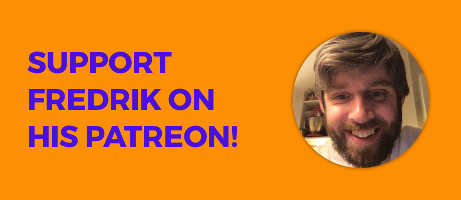

# Pricing 💵

## **Support us by purchasing DLC**

Since our framework is free we are experimenting with different ways of supporting this project financially. A new way of supporting us is to purchase something that we call **Sketch2React DLC.** Basically it's a **super bundle** of all the things locked away on Patreon. 

[Sketch2React DLC\#2 is now available for purchase!](https://gum.co/s2rdlc2)

## **How much does it cost?**

**The version of Sketch2React that you can download via our website is free.** Zero bananas. Zero dollares zero pesetas. _**We will continue to offer our framework and code app for free as long as we can support it.**_ ****Speaking of support, you really should think about supporting us, we are now on Patreon and you can buy lovely bundles way before public release \(DLC\). 

## Patreon

Since Patreon is taxable income and we are not a company \(just two dudes doing great stuff together\) we have one for each of us.

[Read more about it here](https://medium.com/sketch2react/support-sketch2react-on-patreon-b76ef1f21356) or just click on our links below…

### [Support Fredrik's work with Sketch2React](https://www.patreon.com/sketch2react)

#### What does Fredrik do?

* **Develops and maintain our magical framework & code app**
* Product development together with Juan
* Backend stuff
* Writes documentation
* Codes new awesome features and **pushes known boundries of design to code** 
* From time to time he even makes tutorials 👍

### [Support Juan's work with Sketch2React](https://www.patreon.com/designforventures)

#### What does Juan do?

* Responsible for **designing stuff**
* Product development together with Fredrik
* **Video tutorials** and written tutorials
* Writes documentation & blog posts 
* Design and development of our main website
* Tweets a lot 😄

\*\*\*\*

